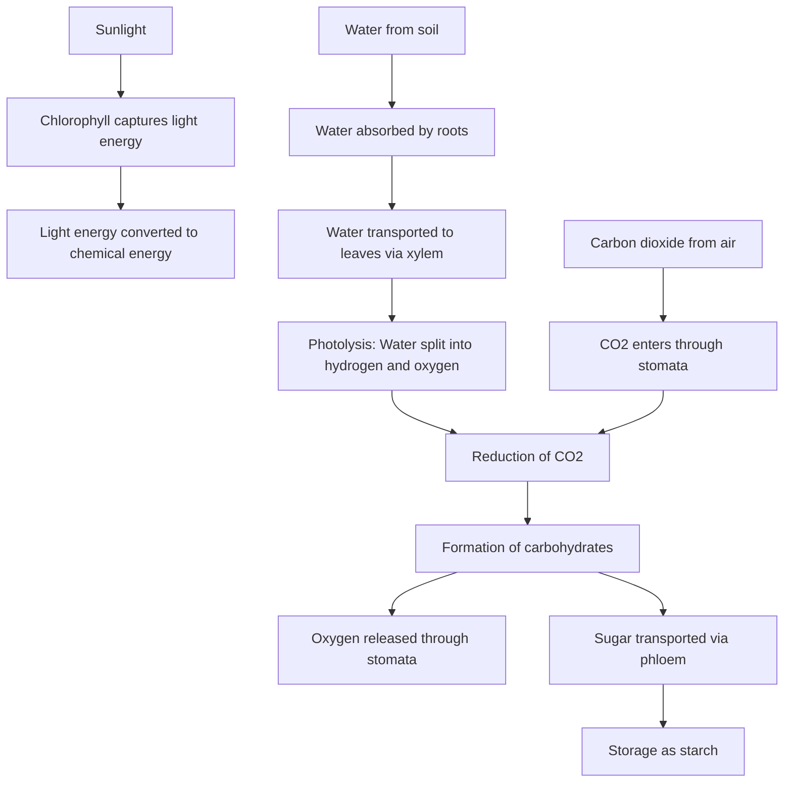
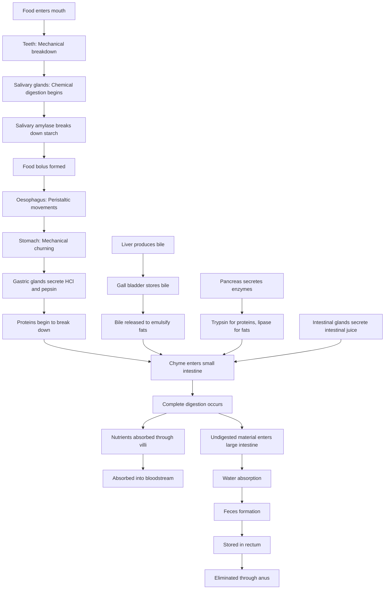
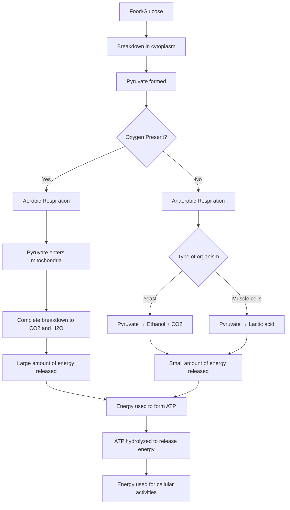
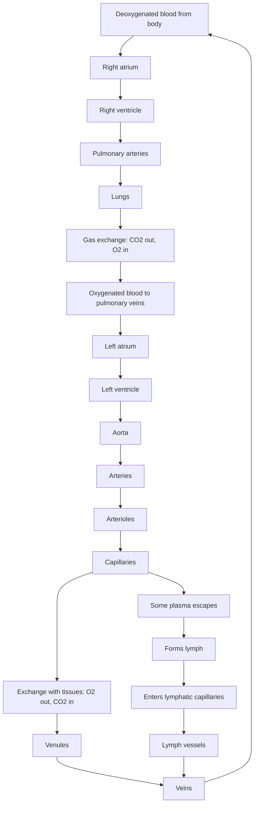
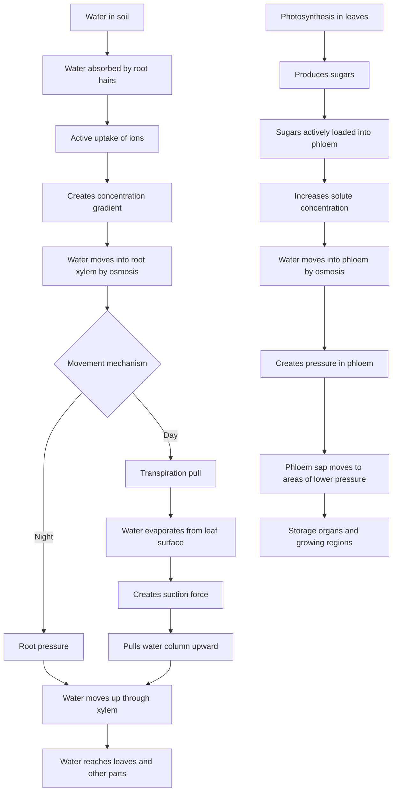
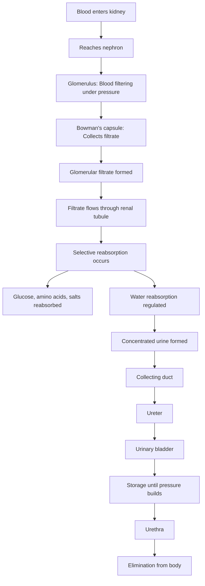

# Class X Biology Chapter 1: Life Processes

## 1. Introduction to Life Processes

### Basic Characteristics of Life
- **Observable characteristics** of living entities include **movement**, **growth**, and **breathing**
- **Limitations** of relying on macroscopic activity: organisms that are **asleep** or **plants not visibly growing** are still alive
- **Molecular movement** is considered a **fundamental requirement** for life according to biologists
- **Viruses** present a unique case – show no molecular movement outside a host cell

### Maintenance in Living Organisms
- **Living organisms** perform **essential maintenance functions** even during **periods of inactivity**
- **Organized structures** in living beings require **continuous repair and upkeep**
- Living organisms work against **tendency towards disorder**, requiring **constant energy expenditure**

### Energy Requirements
- **Energy sources** are **external** to the organism's body, primarily **food**
- **Nutrition** is the process of acquiring and utilizing external energy
- **Raw materials** from surroundings are needed for growth and synthesis
- Most food sources are **carbon-based**

### Energy Transformation
- **External food sources** undergo **transformations** within the body
- **Oxidation-reduction reactions** break down complex molecules to release energy
- **Oxygen** from the external environment facilitates food breakdown via **respiration**
- **Respiration** converts stored energy in food into accessible forms

### Differences Between Unicellular and Multicellular Organisms
- **Unicellular organisms**: entire surface area in direct contact with environment
- **Multicellular organisms**: require **specialized tissues** for specific functions
- **Complex organisms** need **sophisticated transportation systems** to distribute substances
- **Excretory systems** remove waste byproducts

## 2. Nutrition

### Basic Concepts
- **Nutrition**: process of obtaining and utilizing food for energy, growth, and maintenance
- Two main categories: **autotrophs** and **heterotrophs**

### Autotrophic Nutrition
- **Autotrophs**: organisms capable of producing their own food from inorganic substances
- Examples: **green plants** and certain **bacteria**
- **Photosynthesis**: process converting CO₂ and H₂O into carbohydrates using sunlight
- Chemical reaction: Carbon dioxide + Water → (Sunlight, Chlorophyll) → Carbohydrates + Oxygen
- **Raw materials**: water (absorbed by roots), carbon dioxide (entering through stomata)
- **Energy source**: sunlight
- **Chlorophyll**: pigment that captures light energy, located in chloroplasts

### Significance of Photosynthesis
- **Primary mechanism** for making solar energy available to living organisms
- **Green plants** form the base of food webs as **primary producers**
- Maintains **balance of CO₂ and O₂** in atmosphere

### Key Events in Photosynthesis
- **Chlorophyll absorption** of light energy
- **Conversion** of light energy to chemical energy
- **Photolysis**: splitting of water molecules into hydrogen and oxygen
- **Reduction** of carbon dioxide to form carbohydrates

### Storage of Energy
- **Plants** store surplus carbohydrates as **starch**
- **Animals** store energy as **glycogen**

### Heterotrophic Nutrition
- **Heterotrophs**: organisms that cannot synthesize their own food
- Examples: animals and fungi
- Three main types: **holozoic**, **saprophytic**, and **parasitic**

#### Types of Heterotrophic Nutrition
- **Holozoic**: ingestion of complex food, digestion and absorption inside body (Amoeba, humans)
- **Saprophytic**: obtaining nutrients from dead/decaying organic matter (fungi, certain bacteria)
- **Parasitic**: living on/within a host organism (cuscuta, ticks, lice, tapeworms)
- Common feature: use of **enzymes** to break down complex food molecules

### Nutrition in Amoeba
- **Holozoic mode**, **omnivorous** (feeds on microscopic plants and animals)
- Five steps:
  1. **Ingestion**: extending pseudopodia to engulf food (phagocytosis)
  2. **Digestion**: secretion of digestive enzymes into food vacuole
  3. **Absorption**: diffusion of digested food into cytoplasm
  4. **Assimilation**: utilization of absorbed molecules for metabolism
  5. **Egestion**: elimination of undigested waste materials

### Nutrition in Humans
- **Digestive system**: consists of alimentary canal and associated glands
- **Buccal cavity** (mouth): contains teeth, tongue, and salivary glands
  - **Teeth**: mechanically break down food
  - **Tongue**: helps mix food with saliva
  - **Salivary glands**: secrete saliva containing salivary amylase
- **Oesophagus** (food pipe): transfers food to stomach via peristaltic movements
- **Stomach**: J-shaped organ for mechanical and chemical digestion
  - **Gastric glands**: secrete HCl and pepsin
  - **Pepsin**: begins protein digestion
  - **Mucus**: protects stomach lining from acid
- **Small intestine**: primary site for complete digestion and nutrient absorption
  - Receives **bile** from liver/gall bladder to emulsify fats
  - Receives **pancreatic juice** with enzymes like trypsin and lipase
  - **Intestinal juice**: completes digestion of proteins, carbohydrates, and fats
  - **Villi**: increase surface area for absorption
- **Large intestine**: absorbs more water from undigested material
- **Rectum and anus**: store and eliminate solid waste (feces)

## 3. Respiration

### Basic Concepts
- **Respiration**: process of obtaining energy from food
- Involves intake of **oxygen** and breakdown of **organic substances**
- Initial step: breakdown of **glucose** into **pyruvate** in cytoplasm

### Types of Respiration
- **Aerobic respiration**: occurs in presence of oxygen
  - Takes place in **mitochondria**
  - Complete breakdown of pyruvate to CO₂ and H₂O
  - Highly efficient, releases significant energy
- **Anaerobic respiration**: occurs in absence of oxygen
  - Pyruvate converted to other products (ethanol, lactic acid)
  - Yields less energy
  - Examples: fermentation in yeast, lactic acid formation in muscles

### Energy Storage and Use
- Energy released stored as **ATP** (adenosine triphosphate)
- ATP synthesized from **ADP** and inorganic phosphate
- ATP hydrolysis releases approximately **30.5 kJ/mol** of energy
- ATP serves as **energy currency** of the cell

### Respiration in Plants
- Gas exchange through **stomata** and general surface
- Direction of gas movement governed by environmental conditions
- At night: release of CO₂
- During day: CO₂ from respiration often used in photosynthesis

### Respiration in Animals
- **Terrestrial animals**: obtain oxygen directly from atmosphere
- **Aquatic animals**: extract dissolved oxygen from water
- Fish: respire through **gills**
- Terrestrial animals: internal respiratory surfaces with large area

### Human Respiratory System
- Air enters through **nostrils** → **throat** → **lungs**
- **Trachea** (windpipe): supported by cartilage rings
- **Bronchi** → **bronchioles** → **alveoli**
- **Alveoli**: balloon-like structures for gas exchange
- **Inhalation**: lifting of ribs, flattening of diaphragm
- **Exhalation**: ribs move downward, diaphragm relaxes
- **Blood** transports respiratory gases
- **Residual volume**: air always retained in lungs
- **Haemoglobin**: respiratory pigment that binds to oxygen

## 4. Transportation

### Basic Concepts
- **Transportation**: movement of vital substances throughout organism
- Essential for delivering nutrients and oxygen to cells
- Important for removal of waste products

### Transportation in Humans
- **Blood**: primary fluid for transportation
  - Transports: digested food, wastes, gases, hormones, proteins
  - Composed of **plasma** and various **blood cells**
  - **Plasma**: transports dissolved nutrients, CO₂, wastes, etc.
  - **Red blood cells (RBCs)**: contain hemoglobin for oxygen transport
  - **White blood cells (WBCs)**: aid in fighting infections
  - **Platelets**: essential for blood clotting

#### Heart and Circulation
- **Heart**: four-chambered muscular organ
  - Two upper chambers (**atria**) and two lower chambers (**ventricles**)
  - **Ventricles**: thicker walls than atria for pumping blood
  - **Valves**: ensure unidirectional blood flow
  - **Double circulation**: separation of right and left sides
- **Blood vessels**: network of tubes
  - **Arteries**: carry blood away from heart under high pressure
  - **Veins**: collect blood from organs and return to heart
  - **Capillaries**: thin-walled vessels for exchange of substances

#### Lymph
- Fluid that escapes from capillaries
- **Colourless** with less protein than plasma
- Drains into **lymphatic capillaries** → larger vessels → veins
- **Functions**: carries digested fats, drains excess fluid

### Transportation in Plants
- **Xylem**: specialized vascular tissue for upward transport
  - Transports **water and minerals** from roots to other parts
  - Composed of **vessels and tracheids**
  - **Root pressure**: positive pressure in roots pushing water upward
  - **Transpiration pull**: primary force for upward water movement
  - Transpiration: water loss through stomata

- **Phloem**: vascular tissue for translocation
  - Transports **sugars** and other substances in both directions
  - Composed of **sieve tubes and companion cells**
  - Requires energy (**ATP**)
  - Process: active loading of sugars → water movement by osmosis → pressure-driven flow

## 5. Excretion

### Basic Concepts
- **Excretion**: elimination of harmful metabolic waste products
- Crucial for maintaining internal environment
- **Unicellular organisms**: waste removal by simple diffusion
- **Complex organisms**: require specialized organs

### Excretion in Humans
- **Excretory system**: kidneys, ureters, urinary bladder, urethra
- **Kidneys**: primary organs for filtering waste from blood
  - **Nephron**: functional unit of kidney
  - **Glomerulus**: cluster of blood capillaries
  - **Bowman's capsule**: cup-shaped structure enclosing glomerulus
  - **Filtration**: forcing water and small solutes from blood
  - **Reabsorption**: selective recovery of needed substances
  - **Ureter**: tube connecting kidney to bladder
  - **Urinary bladder**: stores urine
  - **Urethra**: expels urine from body
- **Hemodialysis**: artificial kidney procedure for kidney failure

### Excretion in Plants
- **Oxygen**: released as byproduct of photosynthesis
- **Excess water**: removed through transpiration
- **Storage methods**:
  - Cellular vacuoles
  - Resins and gums in older xylem
  - Old leaves that are shed
  - Excretion into surrounding soil

## 6. Summary of Life Processes

- **Nutrition**: obtaining energy and essential nutrients
- **Respiration**: releasing energy stored in food
- **Transportation**: movement of substances throughout organism
- **Excretion**: elimination of metabolic waste products
- All processes are **interconnected** and work in coordination
- Efficient execution maintains **homeostasis**

## Tables

### Table 1: Comparison of Autotrophic and Heterotrophic Nutrition

| Feature | Autotrophic Nutrition | Heterotrophic Nutrition |
|---------|----------------------|-------------------------|
| Food Source | Inorganic components (CO₂, water) | Organic components (from other organisms) |
| Chlorophyll & Sunlight | Required for photosynthesis | Not required |
| Processes Involved | Photosynthesis or chemosynthesis | Digestion, absorption, etc. |
| Organisms | Green plants, some bacteria | Animals, fungi, some bacteria, insectivorous plants |

### Table 2: Comparison of Aerobic and Anaerobic Respiration

| Feature | Aerobic Respiration | Anaerobic Respiration |
|---------|-------------------|----------------------|
| Presence of Oxygen | Present | Absent |
| End Products | Carbon dioxide and water | Ethanol and carbon dioxide or lactic acid |
| Energy Released | More energy | Less energy |
| Location in Cell | Cytoplasm and mitochondria | Cytoplasm only |
| Completeness of Glucose Oxidation | Complete | Incomplete |

### Table 3: Comparison of Xylem and Phloem

| Feature | Xylem | Phloem |
|---------|------|--------|
| Substances Transported | Water and minerals | Food (sugars), amino acids, other substances |
| Direction of Transport | Primarily upwards (unidirectional) | Upwards and downwards (bidirectional) |
| Energy Requirement | Largely passive (transpiration pull) | Active (requires ATP) |
| Cell Types Involved | Vessels and tracheids (mostly dead cells) | Sieve tubes and companion cells (living cells) |

## Flowcharts

### 1. Photosynthesis Process

### 2. Digestive System

### 3. Respiration Process

### 4. Transportation in Humans

### 5. Transportation in Plants

### 6. Excretion in Humans

