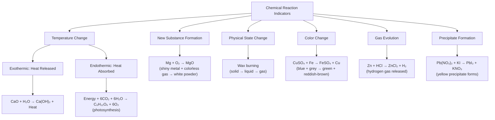
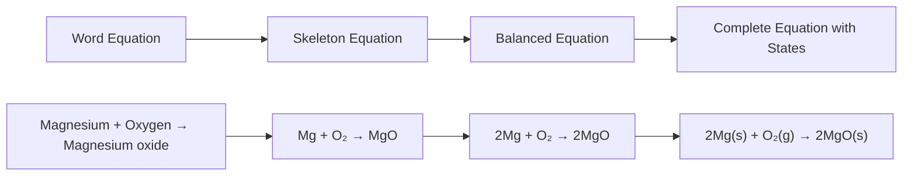
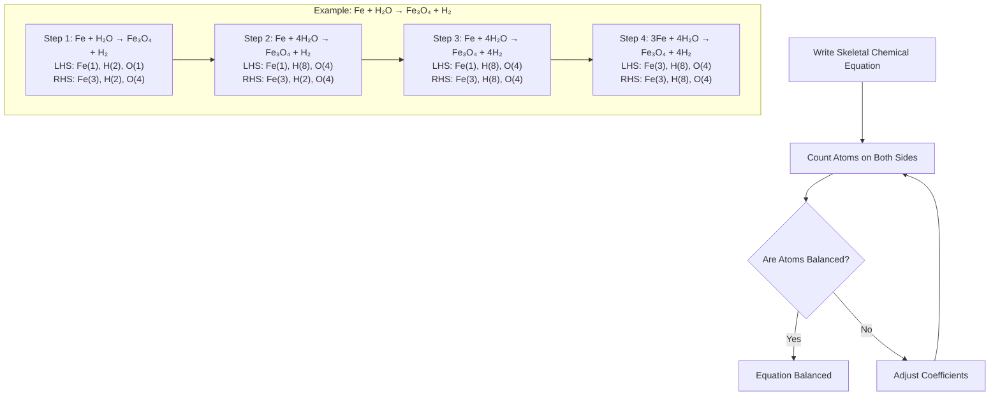
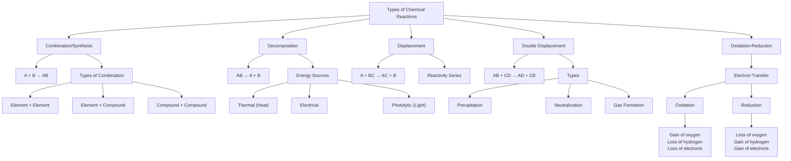
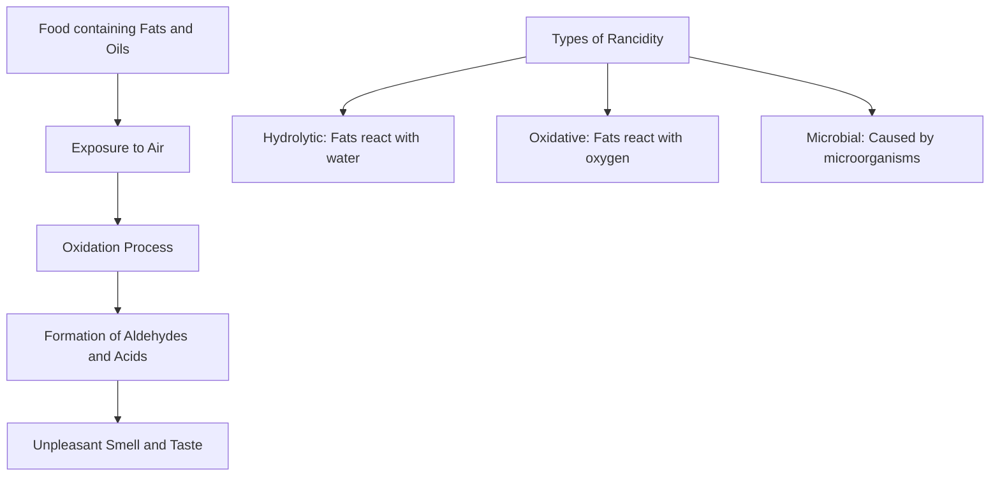

# Comprehensive Notes on Chemical Reactions and Equations

## 1. Introduction to Chemical Reactions and Equations

### Basic Concepts

* A **chemical reaction** is a fundamental process involving the **transformation of substances**
* During reactions, **atoms rearrange** themselves through **breaking and forming chemical bonds**
* Unlike **physical changes**, chemical reactions create **entirely new materials** with different properties
* Chemical reactions follow the **Law of Conservation of Mass**: matter cannot be created or destroyed, only rearranged

### Indicators of Chemical Reactions

* **Formation of new substances** with distinct properties
  * Example: Magnesium (shiny metal) + Oxygen (colorless gas) → Magnesium oxide (white powder)
* **Changes in physical state** of reacting substances
  * Example: Burning wax changes from solid to liquid to gaseous products
* **Change in color**
  * Example: Blue copper sulfate + Grey iron → Green ferrous sulfate solution + Reddish-brown copper
* **Evolution of gas**
  * Example: Zinc + Hydrochloric acid → Hydrogen gas released
* **Change in temperature**
  * **Exothermic reactions**: Release heat (e.g., Calcium oxide + Water generates heat)
  * **Endothermic reactions**: Absorb heat (e.g., Photosynthesis)
* **Formation of precipitate** (insoluble solid separating from solution)
  * Example: Lead nitrate + Potassium iodide → Yellow precipitate



### Everyday Examples of Chemical Reactions

* **Souring of milk**: Lactose converts to lactic acid
* **Rusting of iron**: Iron reacts with oxygen and moisture to form iron oxide
* **Cooking food**: Numerous reactions alter composition and properties of ingredients
* **Digestion**: Breaking down food into simpler substances
* **Respiration**: Glucose combines with oxygen to produce energy, carbon dioxide, and water
* **Fermentation**: Chemical transformations of grapes into wine by microorganisms
* **Photosynthesis**: Carbon dioxide and water combine to form glucose and oxygen
* **Combustion**: Burning of fuels to release energy

### Chemical Equations

* **Chemical equations** use symbols and formulae to represent transformations
* **Reactants** (starting materials) are written on the left-hand side (LHS)
* **Products** (substances formed) are written on the right-hand side (RHS)
* An **arrow (→)** indicates the direction of reaction (read as "yields" or "forms")
* **Multiple reactants or products** are separated by a **plus sign (+)**
* **Physical states** are indicated in parentheses:
  * **(s)** for solid
  * **(l)** for liquid
  * **(g)** for gas
  * **(aq)** for aqueous solution



### Balancing Chemical Equations

* A **balanced chemical equation** has the same number of atoms of each element on both sides
* Based on the **Law of Conservation of Mass**: Matter cannot be created or destroyed
* The **total mass of reactants** must equal the **total mass of products**
* An **unbalanced equation** is called a **skeletal chemical equation**
* Balance by adjusting **coefficients** (numbers before formulas) without changing the formulas themselves

## 2. Writing and Balancing Chemical Equations

### Process of Representing Chemical Reactions

1. **Identify reactants and products**
2. **Write word equation**: Names of reactants → Names of products
3. **Convert to symbolic equation**: Replace names with chemical formulae
4. **Add physical states**: (s), (l), (g), (aq)
5. **Balance the equation**: Adjust coefficients to ensure same number of atoms on both sides

#### Example:
* **Word equation**: Zinc + Sulfuric acid → Zinc sulfate + Hydrogen
* **Symbolic equation**: Zn + H₂SO₄ → ZnSO₄ + H₂
* **Symbolic equation with states**: Zn(s) + H₂SO₄(aq) → ZnSO₄(aq) + H₂(g)
* **Verification**: Already balanced (Zn: 1=1, H: 2=2, S: 1=1, O: 4=4)

### Hit-and-Trial Method for Balancing Equations

* **Adjust coefficients** (numbers in front of formulae) to balance atoms
* **Do not change chemical formulae** themselves
* **Count atoms** of each element on both sides
* **Systematically adjust** until balanced
* **Verify final equation** by recounting all atoms



### Examples of Balancing Equations

#### Example 1: Iron and Water Reaction
* Skeletal equation: Fe(s) + H₂O(l) → Fe₃O₄(s) + H₂(g)
* Initial atom count: LHS (Fe: 1, H: 2, O: 1), RHS (Fe: 3, H: 2, O: 4)
* Step 1: Balance oxygen - Fe(s) + 4H₂O(l) → Fe₃O₄(s) + H₂(g)
* Step 2: Balance hydrogen - Fe(s) + 4H₂O(l) → Fe₃O₄(s) + 4H₂(g)
* Step 3: Balance iron - 3Fe(s) + 4H₂O(l) → Fe₃O₄(s) + 4H₂(g)
* Final atom count: LHS (Fe: 3, H: 8, O: 4), RHS (Fe: 3, H: 8, O: 4)

#### Example 2: Hydrogen and Chlorine Reaction
* Skeletal equation: H₂(g) + Cl₂(g) → HCl(g)
* Initial atom count: LHS (H: 2, Cl: 2), RHS (H: 1, Cl: 1)
* Balanced equation: H₂(g) + Cl₂(g) → 2HCl(g)

#### Example 3: Barium Chloride and Aluminium Sulfate Reaction
* Skeletal equation: BaCl₂(aq) + Al₂(SO₄)₃(aq) → BaSO₄(s) + AlCl₃(aq)
* Balanced equation: 3BaCl₂(aq) + Al₂(SO₄)₃(aq) → 3BaSO₄(s) + 2AlCl₃(aq)

### Additional Information in Chemical Equations

* **Physical states** provide context about the form of substances
* **Reaction conditions** can be indicated above or below the arrow:
  * **Temperature**
  * **Pressure**
  * **Catalyst**
  * **Concentration**
* Example: CO(g) + 2H₂(g) <sup>340atm,Catalyst</sup>→ CH₃OH(l)
* **Reversible reactions** use double arrows (⇌) to indicate that the reaction can proceed in both directions

## 3. Types of Chemical Reactions



### Combination Reactions

* Also known as **synthesis reactions**
* **Two or more reactants** combine to form a **single product**
* General formula: **A + B → AB**
* Often **exothermic** (release energy)

#### Types of Combination Reactions

| Type | General Form | Example | Balanced Equation |
|------|-------------|---------|-------------------|
| Element + Element | X + Y → XY | Hydrogen + Chlorine → Hydrogen Chloride | H₂(g) + Cl₂(g) → 2HCl(g) |
| Element + Compound | X + YZ → XYZ | Carbon dioxide + Water → Carbonic acid | CO₂(g) + H₂O(l) → H₂CO₃(aq) |
| Compound + Compound | XY + ZW → XYZW | Calcium oxide + Water → Calcium hydroxide | CaO(s) + H₂O(l) → Ca(OH)₂(aq) |

#### Examples of Combination Reactions

| Example | Balanced Equation | Observations |
|---------|-------------------|--------------|
| Burning magnesium | 2Mg(s) + O₂(g) → 2MgO(s) | Dazzling white flame, white powder forms |
| Formation of slaked lime | CaO(s) + H₂O(l) → Ca(OH)₂(aq) + Heat | Heat released |
| Burning coal | C(s) + O₂(g) → CO₂(g) | Heat and light released |
| Formation of water | 2H₂(g) + O₂(g) → 2H₂O(l) | Often explosive |
| Formation of sodium chloride | 2Na(s) + Cl₂(g) → 2NaCl(s) | Vigorous reaction |
| Formation of ammonia | N₂(g) + 3H₂(g) → 2NH₃(g) | Requires catalyst, pressure |

### Decomposition Reactions

* A **single reactant** breaks down into **two or more simpler products**
* General formula: **AB → A + B**
* Typically **require energy input** (heat, light, electricity)
* Often **endothermic** (absorb energy)

#### Types of Decomposition Reactions Based on Energy Source

| Type | Energy Source | Example | Balanced Equation |
|------|--------------|---------|-------------------|
| Thermal decomposition | Heat | Calcium carbonate | CaCO₃(s) <sup>Heat</sup>→ CaO(s) + CO₂(g) |
| Electrolytic decomposition | Electricity | Water | 2H₂O(l) <sup>Electricity</sup>→ 2H₂(g) + O₂(g) |
| Photolytic decomposition | Light | Silver chloride | 2AgCl(s) <sup>Sunlight</sup>→ 2Ag(s) + Cl₂(g) |

#### Examples of Decomposition Reactions

| Type | Example | Balanced Equation | Observations |
|------|---------|-------------------|--------------|
| Thermal decomposition | Ferrous sulfate | 2FeSO₄(s) <sup>Heat</sup>→ Fe₂O₃(s) + SO₂(g) + SO₃(g) | Green crystals turn reddish-brown, pungent smell |
| Thermal decomposition | Calcium carbonate | CaCO₃(s) <sup>Heat</sup>→ CaO(s) + CO₂(g) | White solid forms (quicklime), colorless gas released |
| Thermal decomposition | Lead nitrate | 2Pb(NO₃)₂(s) <sup>Heat</sup>→ 2PbO(s) + 4NO₂(g) + O₂(g) | Colorless solid → yellow solid, brown fumes |
| Electrolysis | Water | 2H₂O(l) <sup>Electricity</sup>→ 2H₂(g) + O₂(g) | H₂ at cathode (2× volume of O₂ at anode) |
| Photolytic decomposition | Silver chloride | 2AgCl(s) <sup>Sunlight</sup>→ 2Ag(s) + Cl₂(g) | White solid turns grey |
| Photolytic decomposition | Silver bromide | 2AgBr(s) <sup>Sunlight</sup>→ 2Ag(s) + Br₂(g) | Similar to silver chloride |
| Thermal decomposition | Ammonium dichromate | (NH₄)₂Cr₂O₇(s) <sup>Heat</sup>→ N₂(g) + Cr₂O₃(s) + 4H₂O(g) | "Volcano reaction" with green solid |

### Displacement Reactions

* One **element replaces another element** in a compound
* Occurs when a **more reactive element** displaces a **less reactive** one
* General formula: **A + BC → AC + B** (if A is more reactive than B)
* Based on the **reactivity series of metals**

#### Metal Reactivity Series (Descending Order)
1. Potassium (K)
2. Sodium (Na)
3. Calcium (Ca)
4. Magnesium (Mg)
5. Aluminum (Al)
6. Zinc (Zn)
7. Iron (Fe)
8. Lead (Pb)
9. Hydrogen (H)
10. Copper (Cu)
11. Silver (Ag)
12. Gold (Au)

* A metal can displace any metal below it in the reactivity series

#### Examples of Displacement Reactions

| Example | Balanced Equation | Observations |
|---------|-------------------|--------------|
| Iron with copper sulfate | Fe(s) + CuSO₄(aq) → FeSO₄(aq) + Cu(s) | Blue solution fades to green, reddish-brown copper deposits on iron |
| Zinc with copper sulfate | Zn(s) + CuSO₄(aq) → ZnSO₄(aq) + Cu(s) | Similar to iron reaction |
| Lead with copper chloride | Pb(s) + CuCl₂(aq) → PbCl₂(aq) + Cu(s) | Lead displaces copper |
| Zinc with dilute hydrochloric acid | Zn(s) + 2HCl(aq) → ZnCl₂(aq) + H₂(g) | Hydrogen gas bubbles formed |
| Magnesium with cold water | Mg(s) + 2H₂O(l) → Mg(OH)₂(aq) + H₂(g) | Slow reaction with hydrogen formation |

### Double Displacement Reactions

* **Exchange of ions** between two reactant compounds
* Forms **two new compounds**
* General formula: **AB + CD → AD + CB**
* Often involves formation of a **precipitate**, **gas**, or **water**

#### Types of Double Displacement Reactions

| Type | Characteristic | Example |
|------|---------------|---------|
| Precipitation reactions | Form insoluble solid | AgNO₃(aq) + NaCl(aq) → AgCl(s) + NaNO₃(aq) |
| Neutralization reactions | Acid + Base → Salt + Water | HCl(aq) + NaOH(aq) → NaCl(aq) + H₂O(l) |
| Gas-forming reactions | Release of gas | Na₂CO₃(aq) + 2HCl(aq) → 2NaCl(aq) + H₂O(l) + CO₂(g) |

#### Examples of Double Displacement Reactions

| Example | Balanced Equation | Observations |
|---------|-------------------|--------------|
| Sodium sulfate with barium chloride | Na₂SO₄(aq) + BaCl₂(aq) → BaSO₄(s) + 2NaCl(aq) | White precipitate of barium sulfate forms |
| Potassium iodide with lead nitrate | 2KI(aq) + Pb(NO₃)₂(aq) → PbI₂(s) + 2KNO₃(aq) | Yellow precipitate of lead iodide forms |
| Hydrochloric acid with sodium hydroxide | HCl(aq) + NaOH(aq) → NaCl(aq) + H₂O(l) | Neutralization with salt formation |
| Sodium carbonate with hydrochloric acid | Na₂CO₃(aq) + 2HCl(aq) → 2NaCl(aq) + H₂O(l) + CO₂(g) | Effervescence due to carbon dioxide |

### Oxidation and Reduction Reactions (Redox)

* Involve **electron transfer** between reacting species
* **Oxidation**: Gain of oxygen, loss of hydrogen, or loss of electrons
* **Reduction**: Loss of oxygen, gain of hydrogen, or gain of electrons
* In a redox reaction, **one substance is oxidized** while **another is reduced**
* **Reducing agent**: Gets oxidized while reducing another substance (donates electrons or loses oxygen)
* **Oxidizing agent**: Gets reduced while oxidizing another substance (accepts electrons or provides oxygen)
* Oxidation and reduction **always occur simultaneously**

#### Methods to Identify Oxidation and Reduction

| Method | Oxidation | Reduction |
|--------|-----------|-----------|
| Oxygen transfer | Gain of oxygen | Loss of oxygen |
| Hydrogen transfer | Loss of hydrogen | Gain of hydrogen |
| Electron transfer | Loss of electrons | Gain of electrons |
| Oxidation number | Increase in oxidation number | Decrease in oxidation number |

#### Examples of Redox Reactions

| Example | Balanced Equation | Process Description |
|---------|-------------------|---------------------|
| Copper heated in air | 2Cu(s) + O₂(g) → 2CuO(s) | Copper is oxidized (gains oxygen), oxygen is reduced |
| Copper(II) oxide with hydrogen | CuO(s) + H₂(g) <sup>Heat</sup>→ Cu(s) + H₂O(l) | CuO is reduced (loses oxygen), H₂ is oxidized (gains oxygen) |
| Sodium with oxygen | 4Na(s) + O₂(g) → 2Na₂O(s) | Sodium is oxidized, oxygen is reduced |
| Zinc with hydrogen ions | Zn(s) + 2H⁺(aq) → Zn²⁺(aq) + H₂(g) | Zinc loses electrons (oxidized), H⁺ gains electrons (reduced) |
| Combustion of methane | CH₄(g) + 2O₂(g) → CO₂(g) + 2H₂O(g) | Carbon is oxidized, oxygen is reduced |

## 4. Effects of Oxidation Reactions in Everyday Life

### Corrosion

* **Corrosion**: Process by which **metals are attacked** by substances in their surroundings
* Involves **oxidation of the metal**
* Most common example: **Rusting of iron**

```mermaid
flowchart TD
    A[Iron Metal] --> B[Exposure to Air and Moisture]
    B --> C[Oxidation of Iron]
    C --> D[Formation of Hydrated Iron(III) Oxide]
    D --> E[Reddish-Brown Flaky Rust]
    
    F[Chemical Equation] --> G["4Fe(s) + 3O₂(g) + xH₂O(l) → 2Fe₂O₃.xH₂O(s)"]
    
    H[Factors Accelerating Corrosion] --> I[Presence of Salt]
    H --> J[Temperature Increase]
    H --> K[Higher Humidity]
    H --> L[Acid Rain]
    H --> M[Impurities in Metal]

```

#### Other Examples of Corrosion
* **Silver**: Forms black coating (silver sulfide) from reaction with sulfur compounds
  * 2Ag(s) + H₂S(g) → Ag₂S(s) + H₂(g)
* **Copper**: Develops green coating (copper carbonate) from reaction with carbon dioxide and moisture
  * 2Cu(s) + O₂(g) + CO₂(g) + H₂O(l) → CuCO₃·Cu(OH)₂(s)
* **Aluminum**: Forms protective oxide layer that prevents further corrosion
  * 4Al(s) + 3O₂(g) → 2Al₂O₃(s)

#### Prevention Methods for Corrosion

| Method | Description | Example |
|--------|-------------|---------|
| Painting | Creates physical barrier | Painting iron gates, bridges |
| Oiling/Greasing | Prevents contact with air | Lubricating machine parts |
| Galvanizing | Coating with zinc | Galvanized iron sheets |
| Electroplating | Coating with less reactive metal | Chrome-plated car parts |
| Alloying | Creating corrosion-resistant alloys | Stainless steel (iron + chromium + nickel) |
| Sacrificial protection | Using more reactive metal | Zinc anodes on ship hulls |
| Plastic coating | Applying polymer layer | PVC-coated wires |

### Rancidity

* **Rancidity**: Oxidation of **fats and oils** in food materials
* Results in **change in smell and taste**, making food unpalatable
* Occurs when foods with fats/oils are **exposed to air for prolonged periods**
* Chemical process involves formation of **aldehydes** and **carboxylic acids**



#### Prevention Methods for Rancidity

| Method | Mechanism | Example |
|--------|-----------|---------|
| Adding antioxidants | Inhibit oxidation | BHA, BHT, vitamin E in packaged foods |
| Airtight containers | Reduce oxygen exposure | Sealed food packages |
| Refrigeration | Slow down oxidation rate | Storing butter in refrigerator |
| Nitrogen flushing | Replace oxygen with inert gas | Packaged chips |
| Vacuum packaging | Remove all air | Vacuum-sealed meat products |
| Hydrogenation | Convert unsaturated fats to saturated | Vegetable ghee production |
| Proper storage | Away from light and heat | Dark storage containers |

## 5. Summary of Chemical Reactions and Equations

| Reaction Name | Balanced Chemical Equation | Observations |
|---------------|----------------------------|--------------|
| Burning of Magnesium | 2Mg(s) + O₂(g) → 2MgO(s) | Dazzling white flame, white powder forms |
| Formation of Slaked Lime | CaO(s) + H₂O(l) → Ca(OH)₂(aq) + Heat | Vigorous reaction, heat released |
| Burning of Coal | C(s) + O₂(g) → CO₂(g) | Heat and light released |
| Formation of Water | 2H₂(g) + O₂(g) → 2H₂O(l) | Often explosive |
| Formation of Sodium Chloride | 2Na(s) + Cl₂(g) → 2NaCl(s) | Vigorous reaction |
| Decomposition of Ferrous Sulfate | 2FeSO₄(s) <sup>Heat</sup>→ Fe₂O₃(s) + SO₂(g) + SO₃(g) | Green crystals turn reddish-brown, pungent gases released |
| Decomposition of Calcium Carbonate | CaCO₃(s) <sup>Heat</sup>→ CaO(s) + CO₂(g) | White solid forms, colorless gas released |
| Decomposition of Lead Nitrate | 2Pb(NO₃)₂(s) <sup>Heat</sup>→ 2PbO(s) + 4NO₂(g) + O₂(g) | Colorless solid → yellow solid, brown fumes |
| Electrolysis of Water | 2H₂O(l) <sup>Electricity</sup>→ 2H₂(g) + O₂(g) | H₂ at cathode (2× volume of O₂ at anode) |
| Decomposition of Silver Chloride | 2AgCl(s) <sup>Sunlight</sup>→ 2Ag(s) + Cl₂(g) | White solid turns grey |
| Decomposition of Silver Bromide | 2AgBr(s) <sup>Sunlight</sup>→ 2Ag(s) + Br₂(g) | Similar to silver chloride |
| Reaction of Iron with Copper Sulfate | Fe(s) + CuSO₄(aq) → FeSO₄(aq) + Cu(s) | Blue solution → green, copper deposits on iron |
| Reaction of Zinc with Copper Sulfate | Zn(s) + CuSO₄(aq) → ZnSO₄(aq) + Cu(s) | Similar to iron reaction |
| Reaction of Lead with Copper Chloride | Pb(s) + CuCl₂(aq) → PbCl₂(aq) + Cu(s) | Lead displaces copper |
| Reaction of Sodium Sulfate with Barium Chloride | Na₂SO₄(aq) + BaCl₂(aq) → BaSO₄(s) + 2NaCl(aq) | White precipitate forms |
| Reaction of Potassium Iodide with Lead Nitrate | 2KI(aq) + Pb(NO₃)₂(aq) → PbI₂(s) + 2KNO₃(aq) | Yellow precipitate forms |
| Oxidation of Copper | 2Cu(s) + O₂(g) → 2CuO(s) | Copper forms black copper(II) oxide |
| Reduction of Copper(II) Oxide by Hydrogen | CuO(s) + H₂(g) <sup>Heat</sup>→ Cu(s) + H₂O(l) | Black CuO → reddish-brown Cu |
| Reaction of Sodium with Oxygen | 4Na(s) + O₂(g) → 2Na₂O(s) | Sodium forms sodium oxide |
| Reaction of Zinc with Hydrogen Ions | Zn(s) + 2H⁺(aq) → Zn²⁺(aq) + H₂(g) | Zinc loses electrons, H⁺ gains electrons |
| Rusting of Iron | 4Fe(s) + 3O₂(g) + xH₂O(l) → 2Fe₂O₃.xH₂O(s) | Reddish-brown rust forms on iron surface |

## Conclusion

* **Chemical reactions and equations** form the foundation for understanding chemical transformations
* Key concepts include:
  * **Identifying chemical reactions** through observable changes
  * **Representing reactions** using balanced chemical equations
  * **Law of Conservation of Mass**: Matter cannot be created or destroyed, only rearranged
  * **Classification of reactions**: Combination, decomposition, displacement, double displacement, and redox
  * **Practical applications**: Understanding corrosion and rancidity
* These concepts are essential for further exploration in chemistry