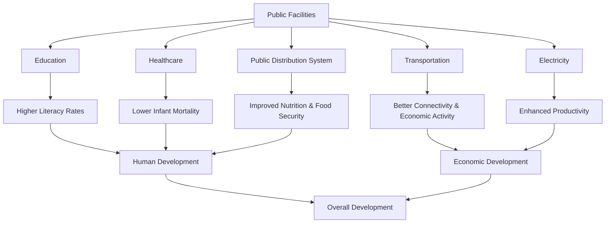
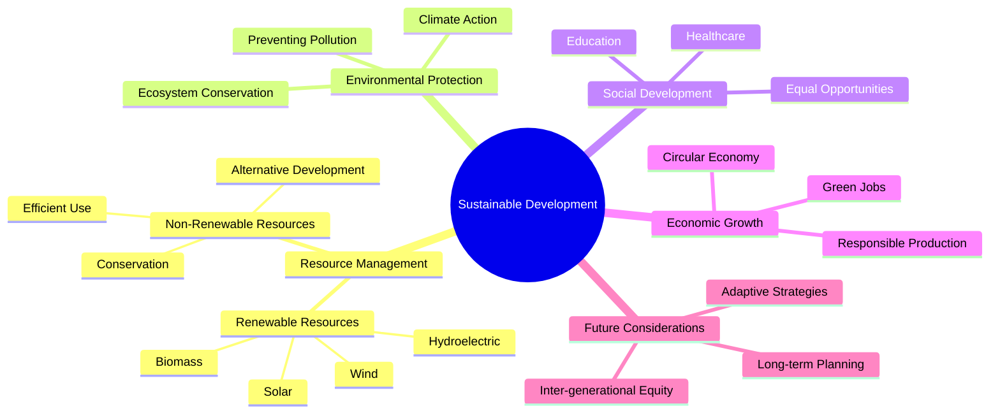
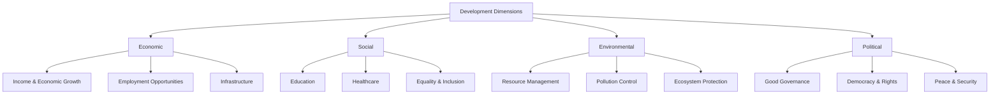

# Understanding Development: An In-depth Analysis of Economic Progress

## Core Concepts of Development

- Development is a fundamental aspect of human thought, shaping both individual and national aspirations
- People have varying perceptions of what constitutes development based on their circumstances:
  - A landless rural laborer may prioritize more workdays and better wages
  - A prosperous farmer might focus on higher support prices for agricultural produce
  - A young urban resident might prioritize better educational institutions and job opportunities
- Development initiatives can lead to conflicting outcomes for different groups
  - Example: Dam construction may generate electricity for industries but displace local communities
- No single, universally accepted definition of development exists, requiring a nuanced approach

## Income and Beyond: Components of Development

- Income is fundamental for meeting daily needs and acquiring essential material goods
- Income generation is linked to various economic activities:
  - Employment
  - Business ownership
  - Agricultural pursuits
- Good quality of life extends beyond material possessions to include:
  - Freedom
  - Security
  - Respect from others
  - Equal treatment
- People consider factors beyond salary when making career decisions:
  - Family-friendly policies
  - Job security
  - Opportunities for professional growth
- Non-material goals have significant economic implications
  - Example: Work environments fostering security and respect can increase productivity

## Comparing Development Across Countries

- Income is a primary attribute for comparing nations
- Total national income alone is not an accurate measure due to population size variations
- Per capita income (average income) provides a better indication of living standards
- The World Bank classifies countries based on per capita income:
  - High-income countries: US$ 12,056 per annum and above (2017)
  - Middle-income countries: US$ 1,036 to US$ 12,535
  - Low-income countries: US$ 955 or less
- India was classified as a low middle-income country with per capita income of $1,820 (2017)
- Per capita income has limitations as it masks income distribution disparities

```mermaid
classDiagram
    class "Income-Based Country Classification" {
        High-Income Countries: ≥$12,056 per annum
        Middle-Income Countries: $1,036 - $12,535
        Low-Income Countries: ≤$955
        India (2017): $1,820 (Low Middle-Income)
    }

```

## Beyond Income: Other Development Indicators

- Security, respect, equal treatment, and freedom are significant factors in development
- Comparison of three Indian states illustrates that money cannot buy all essential elements for good quality of life


| Indicator | Haryana | Kerala | Bihar |
|-----------|---------|--------|-------|
| Per Capita Income | Higher | Lower | Lowest |
| Infant Mortality Rate | Higher | Lowest | Highest |
| Literacy Rate | Moderate | Highest | Lowest |
| Net Attendance Ratio (14-15 years) | Higher | Higher | Lowest |


- Kerala demonstrates better healthcare despite lower per capita income than Haryana
- Kerala leads in literacy rate, showing that income levels don't perfectly correlate with educational attainment
- Bihar has significantly lower school attendance among 14-15 year olds
- Collective provision of goods and services through public systems is often more effective

## Public Facilities and Development

- Public facilities are indispensable for overall country development:
  - Schools
  - Transportation networks
  - Electricity supply
  - Hospitals
  - Community halls
- Government's role in ensuring access to these facilities is paramount
- Benefits of investment in public facilities:
  - Meets essential needs of population
  - Stimulates economic activity
  - Generates employment opportunities
  - Enhances productivity and quality of life
- Kerala's success in health outcomes is attributed to adequate government provision of healthcare and educational facilities
- Public Distribution System (PDS) improves health and nutritional status, particularly for lower socio-economic groups
- Regional disparities in public facilities lead to uneven development



## Sustainable Development

- Current development patterns raise concerns about long-term sustainability
- Issues related to resource depletion:
  - Overuse of groundwater in India for irrigation
  - Heavy reliance on non-renewable resources like crude oil
  - Global crude oil reserves might be depleted within 50-60 years at current consumption rates
- Distinguishing between resource types:
  - Renewable resources: naturally replenished over time (solar, wind energy)
  - Non-renewable resources: limited stock (fossil fuels)
- Sustainable development defined: "Development that meets the needs of the present generation without compromising the ability of future generations to meet their own needs"
- Alternative energy sources for the future:
  - Ethanol
  - Bio-diesel
  - Nuclear energy
  - Wind, solar, geothermal energy
  - Hydrogen, tidal, wave energy
  - Hydroelectric and biomass energy
- Environmental degradation manifestations:
  - Deforestation
  - Soil erosion
  - Declining groundwater levels
  - Depletion of ozone layer
  - Air and water pollution
- Environmental problems have transboundary impacts requiring collective action



## Definitions of Key Terms Related to Development

**Development**: Economic growth of people along with the growth of their basic needs like education, health, lifestyle, etc., aiming to update as per the demand of time; a complex task involving thinking about questions of better life for all, equality, and working towards achieving these goals.

**Per Capita Income**: Total income of a country divided by its total population; also known as average income.

**National Development**: A country's ability to enhance the living standards of its residents; improvement in people's living standards, providing basic things to citizens like food, education, social service, medical aid, etc., and increase in per capita income.

**Infant Mortality Rate (IMR)**: The number of children that die before the age of one year as a proportion of 1,000 live births in a particular year.

**Literacy Rate**: The proportion of the population aged 7 years and above who are able to read, write, and understand.

**Net Attendance Ratio**: The total number of children of age group 14-15 years attending school as a percentage of the total number of children in the same age group.

**Life Expectancy**: The average expected length of life of a person at the time of birth.

**Human Development Index (HDI)**: A composite index published by UNDP that compares countries based on the educational levels of the people, their health status, and per capita income.

**Sustainable Development**: Development that meets the needs of the present without compromising the ability of future generations to meet their own needs.

**Public Facilities**: Services provided by the government to its citizens, including infrastructure, sanitation, public transport, healthcare, and access to water.

**Gross National Income (GNI)**: The total value of goods and services produced within a country together with the income received from other countries (in the form of profits, interest, and dividends).

**Purchasing Power Parity (PPP)**: A way to compare the currencies of different countries through a "basket of goods" approach.

**Body Mass Index (BMI)**: A measure used to assess undernourishment in adults, calculated as weight (in kg) divided by the square of height (in meters).

**Renewable Resources**: Resources that can be replenished naturally over time.

**Non-Renewable Resources**: Resources that have a limited stock and cannot be easily replenished.

## Picture Study Analysis Points

### Different Lifestyles
- Contrasting images show urban and rural lifestyles in India
- One depicts modern amenities and infrastructure (developed area)
- Another shows basic housing and limited resources (less developed area)
- **Analytical Question**: How do these contrasting images illustrate the varying levels of economic development and access to resources in India?

### Farmers at Work
- Traditional farming with basic tools versus modern farming with machinery like tractors
- Small fields versus large agricultural fields
- **Analytical Question**: How might the developmental goals and economic productivity differ between these two farmers?

### Children in School
- Well-equipped urban classroom with modern learning resources
- Basic, possibly open-air rural school
- **Analytical Question**: How do these images highlight the disparities in access to quality education and its implications for human development?

### Factory Production
- Modern factory with automated production lines and advanced technology
- **Analytical Question**: How does industrial development and technological advancement contribute to a nation's economic growth and overall development?

### City Skyline
- Panoramic view of modern city with high-rise buildings and developed infrastructure
- **Analytical Question**: What aspects of a developed economy are typically reflected in the infrastructure and appearance of a modern city?

### Displaced People
- Community relocated or living in temporary shelters due to dam construction
- **Analytical Question**: How can development projects intended to benefit a larger population sometimes lead to displacement and negative consequences for certain communities?

### Environmental Degradation
- Contrasting images of clean flowing river versus heavily polluted river with industrial waste
- **Analytical Question**: How does environmental pollution hinder sustainable development and impact the health and well-being of communities?

### Sustainable Energy Sources
- Field with numerous solar panels capturing sunlight for energy generation
- **Analytical Question**: How can the adoption of renewable energy sources like solar power contribute to environmentally sustainable development?

### Waste Recycling Plant
- Facility where waste materials are sorted and processed for recycling
- **Analytical Question**: How does efficient waste management and recycling play a role in achieving environmental sustainability and resource conservation?

### Public Transportation
- Modern public bus transporting passengers in a city
- **Analytical Question**: How does a well-developed public transportation system contribute to economic development and the quality of life in urban areas?

### Clean Drinking Water Source
- People accessing clean drinking water from a public tap or well
- **Analytical Question**: Why is access to safe and clean drinking water considered a fundamental aspect of human development?



## Important Keywords and Terms
- Developmental goals
- Income
- Non-material goals
- National development
- Per capita income
- Average income
- Developed countries
- Developing countries
- Human Development Index (HDI)
- Infant mortality rate
- Literacy rate
- Net attendance ratio
- Public facilities
- Sustainability of development
- Renewable resources
- Non-renewable resources
- Environmental degradation

## Summary of the Chapter

The chapter "Development" introduces the multifaceted nature of economic progress, highlighting that different individuals and groups can have varying and even conflicting developmental goals. While income is a crucial component of development, it is not the only factor determining the quality of life. Non-material aspects such as freedom, security, and respect are equally important. 

Comparing countries based solely on average income has limitations, as it can mask significant income disparities. Therefore, other indicators like infant mortality rate, literacy rate, and net attendance ratio, which reflect human development, provide a more comprehensive picture of a nation's progress. 

Public facilities provided by the government play a vital role in ensuring basic amenities and promoting human development. Finally, the chapter emphasizes the critical need for sustainable development, which involves using resources responsibly to meet present needs without compromising the ability of future generations to meet their own. 

The question of development is an ongoing dialogue that requires continuous reflection and adaptation to ensure long-term well-being for all.