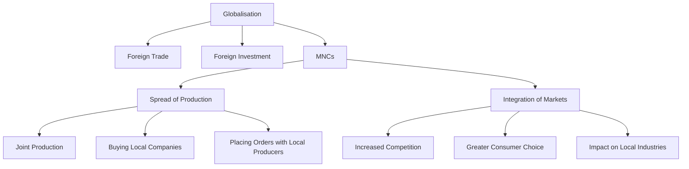
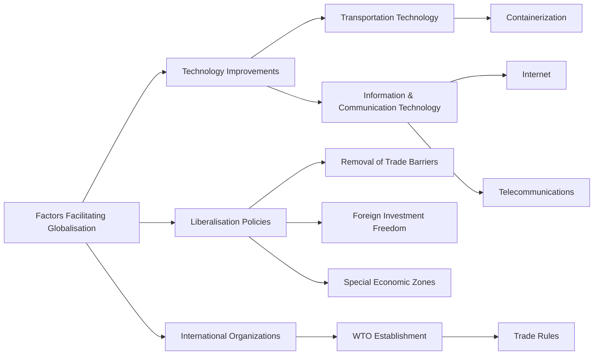
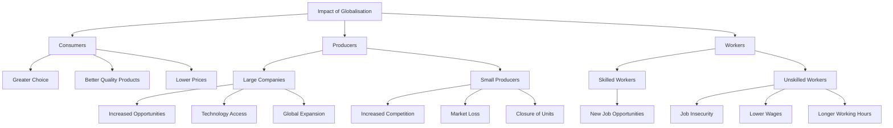

# GLOBALISATION AND THE INDIAN ECONOMY: COMPREHENSIVE NOTES

## Concept of Globalisation

Globalisation refers to the integration between countries through foreign trade and foreign investments by multinational corporations (MNCs). This process has accelerated over the past three decades, leading to significant economic transformations worldwide and in India.

### Historical Context
- Until mid-20th century, production was organized within countries
- Trade was the main connecting channel between distant countries
- Colonies like India exported raw materials and imported finished goods
- MNCs emergence changed traditional trade and production patterns

## Multinational Corporations and Global Production

### Definition and Characteristics
- An MNC is a company that owns or controls production in more than one nation
- MNCs possess enormous wealth, often exceeding budgets of developing countries
- Their location decisions are driven by profit maximization strategies

### Methods of Establishing Global Production Networks

| Method | Description | Example |
|--------|-------------|---------|
| Own production units | Establishing factories in foreign locations | Ford Motors' plant near Chennai |
| Joint ventures | Partnering with local companies | Ford's collaboration with Mahindra & Mahindra |
| Acquiring local companies | Buying existing local businesses | Cargill Foods buying Parakh Foods |
| Outsourcing production | Placing orders with small producers | Women in Ludhiana making footballs |
| Service outsourcing | Hiring local firms for services | Call centers in Bengaluru for customer support |

### Factors Influencing MNC Location Decisions

| Factor | Consideration |
|--------|---------------|
| Market proximity | Setting up production close to target markets |
| Labor costs | Availability of skilled/unskilled labor at low costs |
| Infrastructure | Access to electricity, water, transport, etc. |
| Government policies | Tax incentives, regulations, labor laws |
| Resource availability | Access to raw materials and production factors |
| Special Economic Zones | Areas with special incentives and facilities |

### Case Study: Ford Motors in India
- American automobile manufacturer with production in 26 countries
- Entered India in 1995 with Rs. 1700 crore investment
- Set up plant near Chennai collaborating with Mahindra and Mahindra
- By 2017: sold 88,000 cars domestically, exported 181,000 cars
- Recently stopped domestic production but continues exports

### Case Study: Cargill Foods in India
- Large American MNC bought Indian company Parakh Foods
- Gained control of Parakh's marketing network and four oil refineries
- Became India's largest edible oil producer (5 million pouches daily)

## Foreign Trade and Integration of Markets

### Functions of Foreign Trade
- Creates opportunities for producers to reach beyond domestic markets
- Allows selling goods in international markets
- Enables buyers to access foreign-produced goods
- Expands consumer choices

### Impact on Markets
- Connects markets across countries
- Increases competition between local and foreign producers 
- Results in greater consumer choice
- Can significantly impact local industries

### Case Study: Chinese Toys in India
- Chinese manufacturers exported toys to India's high-priced market
- Indian buyers gained options between domestic and Chinese toys
- Chinese toys became popular due to lower prices and new designs
- Within a year, 70-80% of toy shops replaced Indian toys with Chinese toys
- Toy prices decreased in Indian markets

## Factors Facilitating Globalisation

### Technological Advancements
- Improved transportation technology enabling faster delivery at lower costs
- Containerization reducing port handling costs and increasing export speed
- Revolution in information and communication technology
- Telecommunications facilities (telephones, mobile phones, fax)
- Satellite communication enabling remote information access
- Computers entering almost every field of activity
- Internet allowing information sharing, e-banking, and communication

### Liberalisation of Policies
- Removal of trade barriers (taxes on imports, quotas)
- Easing of foreign investment regulations
- Creating favorable business environment for MNCs
- India's liberalization began around 1991
- Previously, India only allowed imports of essential items
- Liberalization allowed businesses to make free import/export decisions

### Role of International Organizations
- World Trade Organization (WTO) established rules for international trade
- WTO aims to liberalize international trade between countries
- Started at the initiative of developed countries
- About 160 countries are currently WTO members
- Debates exist about fairness in WTO rules implementation
- Developing countries argue developed nations maintain unfair protections

## Impact of Globalisation in India

### Positive Impacts
- Increased consumer choice, especially for urban middle class
- Improved quality and lower prices for several products
- Higher standards of living for well-off sections
- Increased MNC investments creating new jobs
- Local companies supplying to MNCs have prospered
- Indian companies have improved through increased competition
- Some Indian companies have become MNCs themselves
- New opportunities in service sector, particularly IT
- Export of services like data entry, accounting, engineering

### Negative Impacts
- Uneven benefits across population segments
- Small producers face major challenges from competition
- Many small manufacturing units have shut down
- Loss of jobs in certain sectors
- Workers face job insecurity with "flexible" employment
- Decreased permanent employment opportunities
- Longer working hours and night shifts becoming common
- Lower wages in competitive industries

### Government Steps to Attract Foreign Investment
- Creation of Special Economic Zones (SEZs) with world-class facilities
- Tax exemptions for companies in SEZs for initial five years
- Flexibility in labor laws to reduce company costs
- Support for "flexible" hiring practices

## Towards Fair Globalisation

### Challenges for Small Producers
- Rising competition from imports and MNCs
- Higher production costs compared to foreign producers
- Lack of modern technology and infrastructure
- Limited access to credit at reasonable rates
- Case Study: Ravi's capacitor manufacturing unit in Hosur faced crisis after import restrictions were removed in 2001

### Workers' Challenges
- Job insecurity and "flexible" employment terms
- Loss of benefits like health insurance, provident fund
- Reduced wages and forced overtime
- Longer working hours and regular night shifts
- Case Study: Sushila in garment export industry lost permanent worker status, earns less than half her previous wage

### Making Globalisation Fair
- Government role in protecting interests of all citizens
- Proper implementation of labor laws
- Support for small producers to improve performance
- Strategic use of trade and investment barriers when necessary
- Negotiation at WTO for fairer rules
- Alignment with other developing countries
- People's organizations influencing trade decisions

## Key Definitions

- **Globalisation**: Integration between countries through foreign trade and foreign investments by MNCs
- **Multinational Corporation (MNC)**: Company owning/controlling production in multiple nations
- **Investment**: Money spent to buy assets like land, buildings, machines
- **Foreign Investment**: Investment made by MNCs in other countries
- **Market Integration**: Process connecting markets of different countries
- **Foreign Trade**: Buying and selling goods/services between countries
- **Liberalisation**: Removal of government restrictions on trade and investment
- **Trade Barriers**: Restrictions like taxes (tariffs) and quotas on imports
- **Special Economic Zones**: Industrial zones with world-class facilities and tax benefits

## Flowchart: The Process of Globalisation

## Flowchart: Factors Facilitating Globalisation

## Flowchart: Impact of Globalisation on Different Groups

