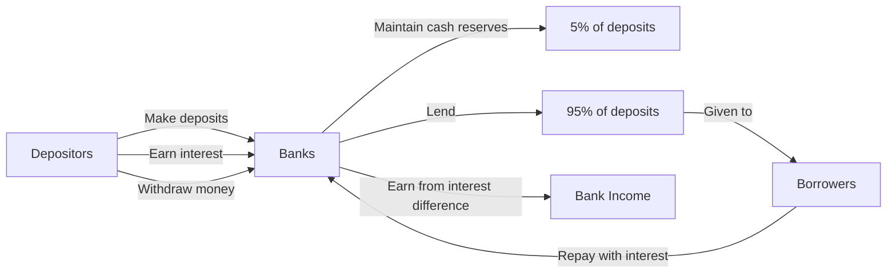
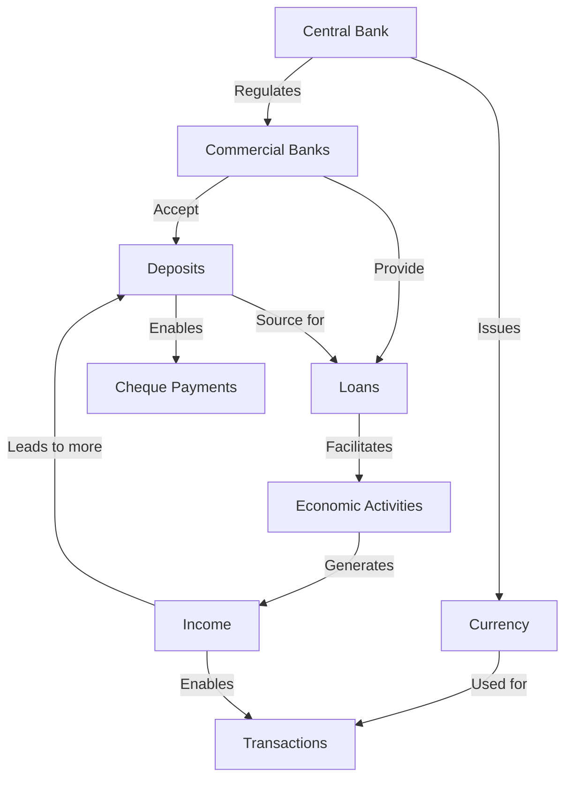
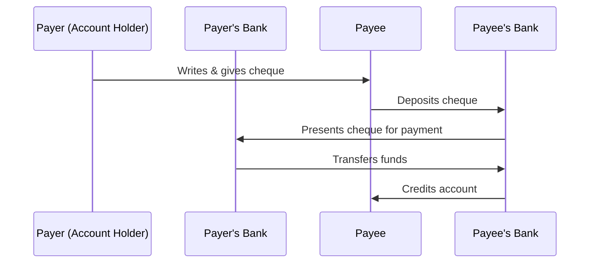

# Comprehensive Notes on Money and Credit (Economics Chapter 3)

This chapter explores money and credit in economic systems. Money enables transactions without barter complexities, while credit facilitates economic activities but can be both beneficial and problematic depending on circumstances.

## Money and Its Functions

### Evolution of Money
- **Historical progression**:
  - Early forms: Grains and cattle in ancient India
  - Metallic phase: Gold, silver, and copper coins
  - Modern currency: Paper notes and non-precious metal coins

| Period | Forms of Money | Characteristics |
|--------|----------------|-----------------|
| Ancient Times | Grains and cattle | Items with inherent use value |
| Medieval to Modern Era | Gold, silver, copper coins | Precious metals with intrinsic value |
| Contemporary Period | Paper currency and coins | No intrinsic value, government authorized |
| Digital Age | Electronic deposits | Virtual representation of value |

### Money as a Medium of Exchange
- Serves as an intermediate step in transactions, eliminating direct exchange requirements
- Solves the "double coincidence of wants" problem found in barter systems
- Example: A shoe manufacturer can sell shoes for money, then use that money to buy wheat without finding someone wanting to trade wheat for shoes

### Characteristics of Money
- Functions effectively when it is:
  - Widely accepted for payments
  - Authorized by legitimate authority
  - Durable and convenient
  - Relatively stable in value
- In India, the rupee is legally recognized as payment medium that cannot be refused

## Modern Forms of Money

### Currency
- Paper notes and coins with no intrinsic value
- Reserve Bank of India issues currency notes on behalf of central government
- No other individual or organization is legally allowed to issue currency
- Value derives from government authorization rather than material content

### Deposits with Banks
- Represents significant form of modern money
- **Demand deposits**: Money in bank accounts withdrawable on demand
- People deposit excess cash for:
  - Safety
  - Interest earnings
  - Withdrawal convenience
- Bank deposits with cheque facilities share essential features of money
- Currency + demand deposits = money in modern economy

| Feature | Currency (Cash) | Demand Deposits |
|---------|----------------|-----------------|
| Physical Form | Tangible notes and coins | Electronic records in bank accounts |
| Issuing Authority | Central Bank (RBI in India) | Commercial banks |
| Accessibility | Immediate, no prerequisites | Requires bank account |
| Interest Earning | No interest | Earns interest |
| Transfer Method | Physical handover | Cheques, electronic transfers |
| Safety Concerns | Risk of theft or loss | Protected by banking regulations |

### Cheque Payments
- Mechanism to make payments without physical cash
- Cheque: Paper instruction to transfer specific amount between accounts
- Process:
  1. Account holder writes cheque specifying amount and recipient
  2. Recipient deposits cheque in their bank account
  3. Money transfers between accounts without physical cash movement

## The Banking System

### Functions of Banks
- Accept deposits and pay interest
- Provide loans to individuals and businesses
- Facilitate payments through cheques and electronic transfers
- Act as intermediaries between surplus fund holders and those needing funds

### Loan Activities of Banks
- Banks keep approximately 5% of deposits as cash reserves
- Majority of deposits used to extend loans
- Income earned through interest rate differential:
  - Higher interest charged on loans than paid on deposits
  - This difference is main source of bank income
- By extending loans, banks create additional purchasing power in economy

### Banking Security and Regulations
- Banks operate under strict regulations for deposit safety
- Maintain sufficient cash reserves for typical withdrawal demands
- System works because only small percentage of depositors withdraw money daily
- Government regulations and central bank oversight prevent "bank runs" and maintain public confidence

## Credit in the Economy

### Understanding Credit
- Agreement where lender supplies money, goods, or services with promise of future payment
- Credit arrangements include:
  - Financial institutions (formal sector)
  - Private lenders (informal sector)
  - Supplier credit (goods now, payment later)
  - Advance payments from buyers
- Bridges timing gaps between income and expenditure

### Credit Situations and Impacts

| Aspect | Positive Example (Salim) | Challenging Example (Swapna) |
|--------|--------------------------|------------------------------|
| Purpose | Working capital for shoe production | Crop cultivation expenses |
| Risk | Market uncertainty | Crop failure due to pests |
| Outcome | Completed order, profit made, loan repaid | Unable to repay, debt grows, forced to sell land |
| Impact | Credit enhances earnings | Credit creates debt trap |

### Terms of Credit
- Every loan agreement specifies:
  - Interest rate borrower must pay
  - Collateral (security) against loans
  - Repayment schedule
- Collateral: Asset (land, building, vehicle, deposits) used as guarantee until loan repayment
- If borrower defaults, lender has right to sell collateral for payment

| Aspect | Formal Sector Credit | Informal Sector Credit |
|--------|---------------------|------------------------|
| Providers | Banks, financial institutions | Moneylenders, traders, landlords |
| Documentation | Formal paperwork required | Often verbal agreements |
| Interest Rates | Regulated, generally lower | Unregulated, often higher |
| Collateral | Typically required | May or may not be required |
| Legal Protection | Governed by regulations | Limited legal protection |
| Accessibility | More procedures, less accessible to poor | More accessible but costlier |

## Formal Sector Credit in India

- RBI supervises formal sources of loans
- Ensures banks maintain required cash balances
- Monitors that banks lend to diverse borrowers including small cultivators and industries
- No organization supervises informal sector lending
- Informal lenders charge much higher interest rates
- Higher borrowing costs mean:
  - Larger portion of earnings used for repayment
  - Less income remaining for borrowers
  - Potential debt traps in severe cases
  - Discourages entrepreneurship

### Credit Distribution
- Formal sector meets only about half of rural credit needs
- Informal sources fulfill remaining credit requirements
- Rich households access cheaper formal credit (83% from formal sources)
- Poor households depend more on expensive informal credit (54% from informal sources)
- Need for greater formal sector credit with equitable distribution

## Self-Help Groups for the Poor

- Organized groups of 15-20 rural poor, particularly women, from same neighborhood
- Members meet and save regularly (Rs 25-100 or more per member)
- Members can take small loans from group at lower interest than moneylenders
- After consistent savings, group becomes eligible for bank loans
- Loans provided for:
  - Releasing mortgaged land
  - Working capital needs (seeds, fertilizers, raw materials)
  - Housing materials
  - Asset acquisition (sewing machines, handlooms, cattle)
- Key decisions on savings and loans taken by group members
- Group responsible for loan repayment
- Benefits:
  - Overcomes collateral problem
  - Provides timely loans at reasonable rates
  - Builds financial self-reliance
  - Creates platform for discussing social issues

## The Grameen Bank Model

- Started in 1970s Bangladesh as small project
- By 2018: 9 million members across 81,600 villages
- Almost all borrowers are women from poorest sections
- Demonstrated that poor women are reliable borrowers
- Successfully supports small income-generating activities

## Summary of Money and Credit

Modern money consists of currency and demand deposits with banks. The banking system facilitates transactions by accepting deposits and providing loans, creating an efficient economic environment. Credit arrangements vary between formal and informal sectors, with significant differences in terms and accessibility. While credit can enhance productivity and income, unfavorable terms can lead to debt traps. Expanding formal sector credit with more equitable distribution is essential for economic development. Self-help groups provide an innovative model for increasing credit access among the poor.

## Banking Operations Flow

## Money Flow in Economy

## Cheque Payment Process

