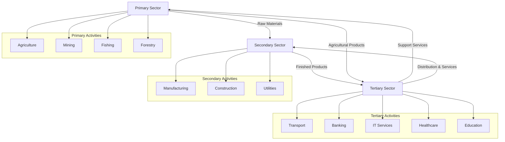
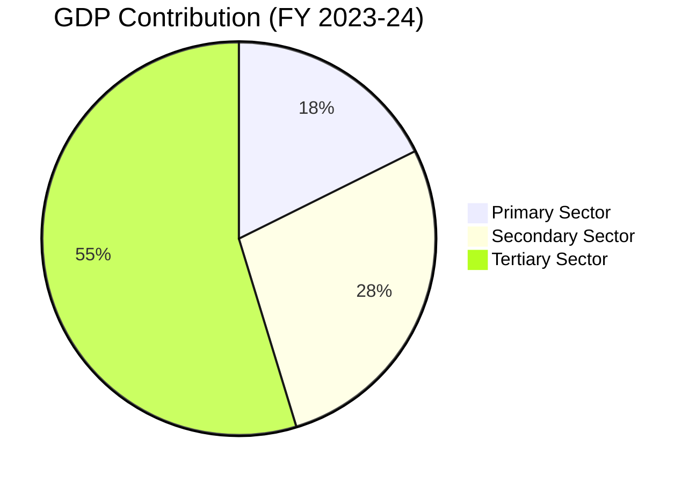
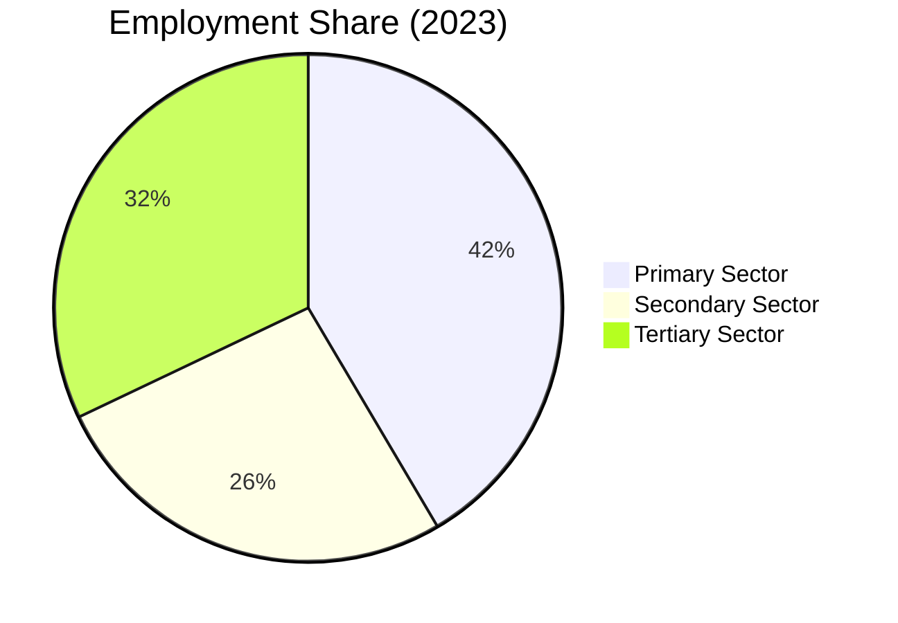
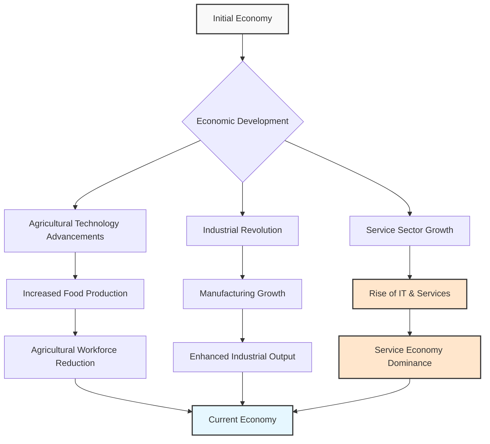

# Sectors of the Indian Economy: An In-Depth Analysis

## I. Introduction

- The study of economic sectors provides a framework for understanding the structure and dynamics of any economy
- For India, examining economic sectors is crucial to comprehend its development trajectory
- This report explores the primary, secondary, and tertiary sectors, their definitions, activities, significance, and interconnections

## II. Defining the Sectors of the Indian Economy

### A. Primary Sector: The Foundation of Natural Resource Exploitation

- **Definition**: The primary sector encompasses all activities involving direct utilization of natural resources to produce raw materials
- Also referred to as the agriculture and related sector due to its close association with land-based occupations
- **Key activities**: Agriculture, forestry, fishing, mining, and dairying
- **Economic significance**:
  - Historically held paramount importance in the Indian economy
  - Continues to provide livelihoods for a substantial portion of the population
  - In 2023, accounted for approximately 16% of GDP while employing around 40-45% of the workforce
  - Lower productivity per worker compared to other sectors
- **Challenges**: Dependence on natural elements like rainfall and climate makes it susceptible to environmental fluctuations

### B. Secondary Sector: Transforming Raw Materials into Finished Goods

- **Definition**: The sector where raw materials from the primary sector are transformed into finished goods through manufacturing and industrial processes
- Also known as the industrial sector
- **Key activities**: 
  - Manufacturing (textiles, automobiles, chemicals, steel)
  - Construction (infrastructure and structures)
  - Utilities (electricity, gas, water supply)
- **Examples**: Spinning yarn from cotton fibers to produce cloth, using sugarcane to manufacture sugar
- **Economic significance**:
  - Critical for driving economic growth by enhancing value of raw materials
  - Important source of employment (over 25% of India's workforce)
  - Contributes nearly 25% to India's GDP
  - Indicator of a nation's progress towards industrialization
- **Role**: Forms vital link between primary sector (raw materials) and tertiary sector (distribution and marketing)

### C. Tertiary Sector: The Realm of Services and Support

- **Definition**: Encompasses activities that provide services rather than producing tangible goods
- Also referred to as the service sector
- **Characteristics**: Provision of intangible services including attention, advice, access, experience, and affective labor
- **Key activities**: Transportation, communication, banking, insurance, trade, healthcare, education, information technology, tourism
- **Examples**: Teachers providing education, doctors offering healthcare, lawyers giving legal counsel, IT companies developing software
- **Economic significance**:
  - Largest producing sector in India
  - In 2018-19, contributed 54.40% to India's Gross Value Added (GVA)
  - Reflects global trend of transition towards service-based economies
- **Role**: Indispensable for smooth functioning of primary and secondary sectors
- **Development trend**: Uneven growth across sub-sectors (IT and BPO growing rapidly, traditional services lagging)

## III. Interdependence of the Three Sectors

- The primary, secondary, and tertiary sectors are intricately linked, creating a cyclical flow of resources and services
- **Primary-Secondary connection**:
  - Primary sector provides raw materials for manufacturing (e.g., cotton for textile mills, sugarcane for sugar production)
  - Secondary sector supplies manufactured goods like tractors, irrigation equipment, pesticides, and fertilizers to enhance agricultural productivity
- **Tertiary sector's facilitative role**:
  - Transportation services move raw materials and finished goods
  - Financial services provide capital and risk management
  - Trade and commerce enable buying and selling of goods
- **Impact of disruptions**: Problems in one sector affect others (e.g., transport strikes leading to food scarcity and farmers unable to sell produce)
- Efficient functioning of all sectors is essential for sustained economic growth

## IV. Contribution to GDP and Employment

### A. Gross Domestic Product (GDP) Contribution

- GDP is a key indicator of economic output, representing total value of final goods and services produced within a country
- Indian economy has transformed over time:
  - Initially, primary sector was largest GDP contributor
  - Later, secondary sector gained momentum through industrialization
  - Currently, tertiary sector dominates, accounting for over 50% of GDP
- This transition follows pattern observed in developing economies as they mature

### B. Employment Share

- Despite tertiary sector's GDP dominance, employment distribution shows different picture
- Primary sector (particularly agriculture) employs largest proportion of workforce
- High employment in primary sector with lower GDP contribution indicates:
  - Potential underemployment
  - Disguised unemployment (more people engaged than needed)
  - Lower productivity per person
  - Lower per capita income in this sector
- This disparity represents a structural challenge in the Indian economy

### C. Sector-wise Contribution to GDP and Employment

| Sector | Contribution to GDP (FY 2023-24) | Share of Employment (2023) |
|--------|----------------------------------|----------------------------|
| Primary Sector | ~17.66% | ~44% |
| Secondary Sector | ~27.62% | ~28% |
| Tertiary Sector | ~54.72% | ~34% |

## V. Historical Changes and the Rise of the Tertiary Sector

- **Initial stage**: Agriculture (primary sector) was predominant economic activity
- **Transformation factors**:
  - Advancements in agricultural technology increased food production
  - Industrial revolution sparked secondary sector growth
  - Tertiary sector eventually surpassed both in terms of output and employment
- **Factors contributing to tertiary sector prominence**:
  1. Development of essential services (healthcare, education, banking)
  2. Growth of primary and secondary sectors creating demand for supporting services
  3. Rising income levels increasing demand for leisure activities and private services
  4. Emergence of information and communication technology (ICT)
- India has become a global hub for IT and IT-enabled services
- This service-oriented transition represents India's unique economic development path

## VI. Organized and Unorganized Sectors

### Organized Sector

- **Characteristics**:
  - Enterprises registered with government
  - Fixed terms of employment and job security
  - Adherence to government regulations
  - Benefits like paid leave, holiday pay, provident funds, gratuity
- **Examples**: Government employees, private corporate jobs

### Unorganized Sector

- **Characteristics**:
  - Small and scattered units outside government control
  - Lack of job security
  - Low and irregular wages
  - No benefits like paid leave or overtime compensation
- **Examples**: Street vendors, agricultural laborers, domestic workers
- **Challenges**: Long working hours, job insecurity, inconsistent pay, lack of social security
- A significant portion of India's workforce remains in the unorganized sector
- Highlights the dualistic nature of Indian labor market

| Parameter | Organized Sector | Unorganized Sector |
|-----------|------------------|-------------------|
| Registration | Registered with government | Largely unregistered |
| Employment Terms | Fixed and formal | Irregular and informal |
| Job Security | High | Low or none |
| Wages | Regular and standardized | Low and irregular |
| Benefits | Paid leave, provident fund, gratuity | Few or no benefits |
| Working Conditions | Regulated | Often poor |
| Examples | Government jobs, corporate positions | Street vendors, agricultural laborers |

## VII. Public and Private Sectors

### Public Sector

- **Definition**: Government owns majority of assets and provides services
- **Objective**: Promote public welfare rather than just earn profits
- **Examples**: Railways, post offices, government hospitals, defense services
- **Financing**: Through taxes and other government revenue
- **Role**: Provides essential services at affordable rates, develops infrastructure, supports agriculture

### Private Sector

- **Definition**: Assets owned and services delivered by private individuals or companies
- **Objective**: Primarily driven by profit motive
- **Examples**: Tata Iron and Steel Company Limited (TISCO), Reliance Industries Limited (RIL)
- **Role**: Contributes to production, innovation, and employment generation

- **Indian Economy Structure**: Operates as a mixed economy where both public and private sectors coexist

| Parameter | Public Sector | Private Sector |
|-----------|--------------|----------------|
| Ownership | Government | Private individuals/companies |
| Primary Objective | Public welfare | Profit generation |
| Decision Making | Bureaucratic/political | Market-driven |
| Financing | Government funds/taxes | Private capital/investment |
| Examples | Railways, post offices, defense | TISCO, Reliance Industries |
| Key Focus | Essential services, infrastructure | Market-driven production |

## VIII. Key Definitions

- **Primary Sector**: Economic activities involving the direct exploitation of natural resources.
- **Secondary Sector**: Economic activities involving the transformation of raw materials into finished goods through manufacturing and industrial processes.
- **Tertiary Sector**: Economic activities that provide services rather than producing tangible goods, supporting the primary and secondary sectors.
- **GDP (Gross Domestic Product)**: The monetary value of all final goods and services produced within a country's borders in a specific period.
- **Disguised Unemployment**: A situation where more people are employed in a task than are actually needed, often seen in the primary sector.
- **Underemployment**: A situation where individuals are working less than their potential or in jobs that do not fully utilize their skills and education.
- **Organized Sector**: Enterprises registered with the government that provide fixed employment terms, job security, and benefits.
- **Unorganized Sector**: Small, scattered units largely outside government control, characterized by low pay, irregular jobs, and lack of benefits.
- **Public Sector**: Sector where the government owns most of the assets and provides services, with the aim of public welfare.
- **Private Sector**: Sector where assets are owned and services are delivered by private individuals or companies, primarily driven by the motive of profit.

## IX. Summary and Conclusion

- The Indian economy is structured around three interconnected sectors: primary, secondary, and tertiary
- These sectors exhibit strong interdependence, each relying on others for inputs, outputs, and support
- Historical shift has occurred in GDP contribution pattern:
  - Primary sector initially dominant
  - Now tertiary sector is largest contributor
  - Primary sector remains largest employer despite lower GDP contribution
- The economy can also be classified by:
  - Employment conditions (organized vs. unorganized sectors)
  - Ownership structure (public vs. private sectors)
- Key challenges include:
  - Employment-GDP disparity in primary sector
  - Poor conditions in unorganized sector
  - Need for balanced development across sectors
- Understanding sector dynamics is crucial for comprehending India's economic complexities and development trajectory
- Addressing these challenges while leveraging tertiary sector growth potential will be vital for India's continued economic development and inclusive growth

## X. Important Keywords and Terms

| Category | Keywords |
|----------|----------|
| Sector Classification | Primary Sector, Secondary Sector, Tertiary Sector, Agriculture, Industry, Services |
| Economic Indicators | GDP, Employment, Value Addition, Productivity, Per Capita Income |
| Labor Market | Organized Sector, Unorganized Sector, Disguised Unemployment, Underemployment, Job Security, Social Security |
| Ownership Structure | Public Sector, Private Sector, Mixed Economy, Public Welfare, Profit Motive |
| Resources | Natural Resources, Manufacturing, Final Product, Infrastructure Development |
| Development | Economic Growth, Structural Transformation, Livelihood, Global Outsourcing Hub, Make in India |