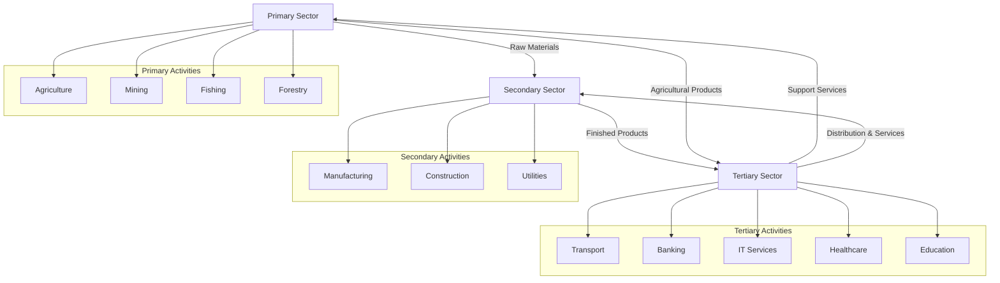
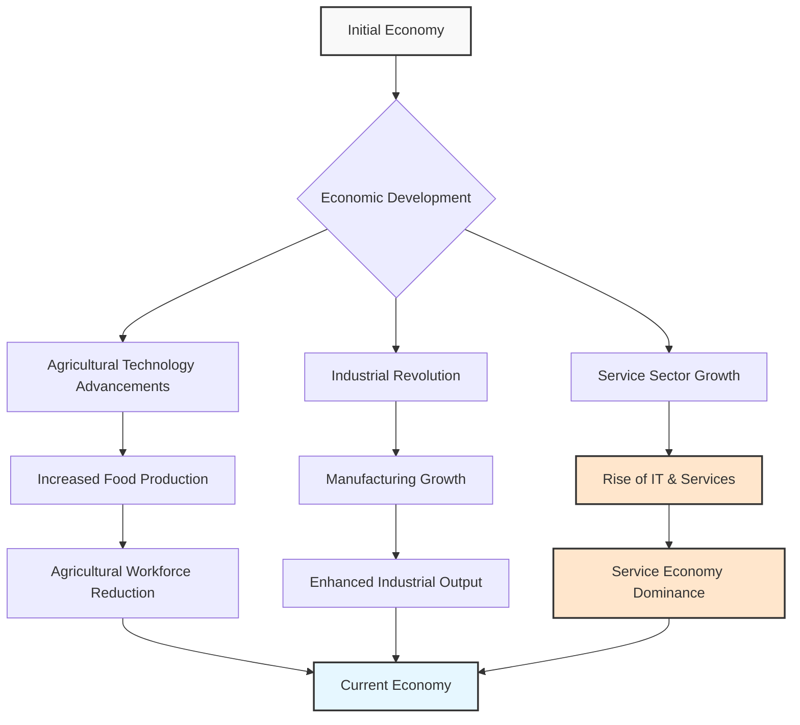

# Sectors of the Indian Economy: An In-Depth Analysis

## I. Introduction

The study of economic sectors provides a fundamental framework for understanding the structure and operational dynamics of any economy. By categorizing economic activities into distinct groups, it becomes possible to analyze the contributions, interrelationships, and evolutionary trends that shape a nation's economic landscape. For India, a country undergoing rapid economic transformation, a detailed examination of its economic sectors is crucial for comprehending its developmental trajectory, identifying existing challenges, and recognizing potential avenues for future progress. This report delves into the primary, secondary, and tertiary sectors of the Indian economy, exploring their definitions, activities, significance, and the intricate connections that bind them together.

## II. Defining the Sectors of the Indian Economy

### A. Primary Sector: The Foundation of Natural Resource Exploitation

**Definition**: The primary sector forms the bedrock of an economy, encompassing all activities that involve the direct utilization of natural resources to produce raw materials.

**Key Characteristics and Activities**:

| Characteristic | Description |
|---------------|-------------|
| Nature of Activity | Direct utilization of natural resources |
| Also Known As | Agriculture and related sector |
| Key Activities | Agriculture, forestry, fishing, mining, dairying |
| GDP Contribution (2023) | Approximately 16% |
| Employment Share | Around 40-45% of the workforce |
| Vulnerability | Highly dependent on rainfall, sunshine, and climate |

**Primary Sector Issues**:
- Lower productivity per worker compared to other sectors
- Traditional farming practices limit output
- Limited access to advanced technology and infrastructure
- Prevalence of smaller landholdings affecting efficiency
- High susceptibility to environmental fluctuations
- Requires government support through irrigation and infrastructure investments

### B. Secondary Sector: Transforming Raw Materials into Finished Goods

**Definition**: The secondary sector represents the stage of economic activity where raw materials, sourced from the primary sector, are transformed into finished goods through manufacturing and industrial processes.

**Key Characteristics and Activities**:

| Characteristic | Description |
|---------------|-------------|
| Nature of Activity | Transformation of raw materials into finished goods |
| Also Known As | Industrial sector |
| Key Activities | Manufacturing (textiles, automobiles, chemicals, steel), construction, utilities (electricity, gas, water supply) |
| Examples | Spinning yarn from cotton, manufacturing sugar from sugarcane |
| GDP Contribution | Nearly 25% |
| Employment Share | Over 25% of total workforce |
| Significance | Critical indicator of industrialization and economic development |

**Secondary Sector Role**:
- Enhances value of raw materials
- Generates significant industrial output
- Forms vital link between primary and tertiary sectors
- Drives economic growth and development
- Accelerates economic expansion through higher-value products

### C. Tertiary Sector: The Realm of Services and Support

**Definition**: The tertiary sector, often referred to as the service sector, encompasses a broad spectrum of economic activities that provide services rather than producing tangible goods.

**Key Characteristics and Activities**:

| Characteristic | Description |
|---------------|-------------|
| Nature of Activity | Provision of intangible services |
| Also Known As | Service sector |
| Key Services | Transportation, communication, banking, insurance, trade, healthcare, education, IT, tourism |
| Examples | Teachers providing education, doctors offering healthcare, lawyers giving legal counsel, IT companies developing software |
| GDP Contribution (2018-19) | 54.40% of GVA |
| Growth Trend | Emerged as largest producing sector |
| Growth Disparity | Uneven growth across sub-sectors (e.g., rapid in IT, slower in traditional services) |

**Tertiary Sector Significance**:
- Indispensable for smooth functioning of primary and secondary sectors
- Provides essential support services like transportation, banking, communication
- Reflects global trend of transition toward service-based economies
- Creates varied employment opportunities with different skill requirements

## III. Interdependence of the Three Sectors

The primary, secondary, and tertiary sectors are intricately linked and exhibit a high degree of interdependence, essential for the overall functioning and growth of the Indian economy.

**Key Interdependencies**:

| Flow Direction | Relationship |
|---------------|-------------|
| Primary → Secondary | Provides raw materials (e.g., cotton for textile mills, sugarcane for sugar production) |
| Secondary → Primary | Supplies manufactured goods (tractors, irrigation equipment, pesticides, fertilizers) |
| Tertiary → Primary | Facilitates through transportation, banking, insurance, trading services |
| Tertiary → Secondary | Provides essential services for industrial operations and distribution |
| Impact of Disruption | Disruption in one sector creates ripple effects across others (e.g., transport strike affects food distribution) |

**Importance of Coordination**:
- Efficient and coordinated functioning of all sectors is paramount for sustained growth
- Bottlenecks in any sector impede overall economic performance
- The cyclical flow of resources and services creates economic interdependence
- Price changes in one sector affect costs in others (e.g., industrial input costs affect cultivation costs)

## IV. Contribution to GDP and Employment

**Gross Domestic Product (GDP) Contribution**:
- GDP represents the total value of final goods and services produced within India's borders during a specific period
- Sectoral contributions to GDP reveal the changing structure of the economy
- Transition from primary sector dominance to tertiary sector leadership reflects economic maturation

**Employment Share**:
- Employment distribution across sectors differs from GDP contribution pattern
- Primary sector employs largest proportion despite lower GDP contribution
- This disparity suggests underemployment or disguised unemployment
- Lower productivity per person in primary sector leads to lower per capita income

**Sector-wise Contribution to GDP and Employment**:

| Sector | Contribution to GDP (FY 2023-24) | Share of Employment (2023) |
|---------------|-------------|-------------|
| Primary Sector | ~17.66% | ~44% |
| Secondary Sector | ~27.62% | ~28% |
| Tertiary Sector | ~54.72% | ~34% |

**Key Observations**:
- Tertiary sector dominates economic output
- Primary sector remains largest employer
- Secondary sector occupies intermediate position in both aspects
- Structural challenge exists in addressing employment-GDP contribution disparity

## V. Historical Changes and the Rise of the Tertiary Sector

**Historical Transformation**:

| Period | Dominant Sector | Key Developments |
|---------------|-------------|-------------|
| Initial Phase | Primary (Agriculture) | Traditional agricultural economy |
| Industrial Revolution | Rise of Secondary | Manufacturing became key economic driver |
| Recent Decades | Tertiary Dominance | Service sector surpassed both primary and secondary |

**Factors Contributing to Tertiary Sector Growth**:

1. Development of essential services:
   - Healthcare facilities
   - Educational institutions
   - Postal and telegraph services
   - Law enforcement agencies
   - Banking institutions

2. Growth-induced demand for support services:
   - Transportation
   - Trade
   - Storage

3. Rising income levels creating demand for:
   - Leisure activities (dining out, tourism)
   - Private healthcare
   - Enhanced education services

4. Information and Communication Technology (ICT) revolution:
   - India's emergence as global IT hub
   - Rapid growth of IT-enabled services
   - Significant contribution to economic growth and global standing

**Significance**:
- Transition to service-oriented economy reflects global economic development pattern
- IT sector growth allowed India to carve unique development path
- Service sector expansion creates diverse employment opportunities

## VI. Organized and Unorganized Sectors

| Characteristic | Organized Sector | Unorganized Sector |
|---------------|-------------|-------------|
| Definition | Enterprises registered with government providing fixed terms of employment | Small, scattered units largely outside government control |
| Employment Terms | Job security, regulated working conditions | Lack of job security, irregular employment |
| Benefits | Paid leave, holiday pay, provident funds, gratuity | Few or no benefits, absence of social security |
| Working Conditions | Regulated hours, workplace safety standards | Often long hours without overtime compensation |
| Wage Structure | Fixed, regular wages with increments | Low, irregular wages |
| Examples | Government employees, corporate employees | Street vendors, agricultural laborers, domestic workers |
| **Challenges** | High operating costs, bureaucratic processes, rigid labor laws | Long working hours, job insecurity, low/inconsistent pay, lack of social security, poor working conditions |

**Key Issues**:
- Significant portion of India's workforce remains in unorganized sector
- Highlights dualistic nature of Indian labor market
- Pressing need for policies to improve working conditions in unorganized sector
- Social security and fair wage implementation remain critical challenges

## VII. Public and Private Sectors

| Characteristic | Public Sector | Private Sector |
|---------------|-------------|-------------|
| Definition | Government owns majority of assets and provides services | Assets owned and services delivered by private individuals/companies |
| Primary Objective | Public welfare, not solely profit | Earning profits |
| Funding | Tax revenue and other government sources | Private investment, market operations |
| Examples | Railways, post offices, government hospitals, defense services | Tata Iron and Steel Company Limited (TISCO), Reliance Industries Limited (RIL) |
| Key Functions | Providing essential services at affordable rates, developing infrastructure, supporting critical sectors | Production, innovation, employment generation |

**India's Mixed Economy**:
- Both public and private sectors coexist and contribute to economic progress
- Government undertakes activities for public welfare and essential services
- Private sector driven by market forces and profit motive
- Balance between sectors important for inclusive growth

## VIII. Key Definitions

- **Primary Sector**: Economic activities involving the direct exploitation of natural resources.
- **Secondary Sector**: Economic activities involving the transformation of raw materials into finished goods through manufacturing and industrial processes.
- **Tertiary Sector**: Economic activities that provide services rather than producing tangible goods, supporting the primary and secondary sectors.
- **GDP (Gross Domestic Product)**: The monetary value of all final goods and services produced within a country's borders in a specific period.
- **Disguised Unemployment**: A situation where more people are employed in a task than are actually needed, often seen in the primary sector.
- **Underemployment**: A situation where individuals are working less than their potential or in jobs that do not fully utilize their skills and education.
- **Organized Sector**: Enterprises registered with the government that provide fixed employment terms, job security, and benefits.
- **Unorganized Sector**: Small, scattered units largely outside government control, characterized by low pay, irregular jobs, and lack of benefits.
- **Public Sector**: Sector where the government owns most of the assets and provides services, with the aim of public welfare.
- **Private Sector**: Sector where assets are owned and services are delivered by private individuals or companies, primarily driven by the motive of profit.

## IX. Summary and Conclusion

- The Indian economy is structured around three interconnected sectors: primary, secondary, and tertiary
- These sectors exhibit strong interdependence, each relying on others for inputs, outputs, and support
- Historical shift has occurred in GDP contribution pattern:
  - Primary sector initially dominant
  - Now tertiary sector is largest contributor
  - Primary sector remains largest employer despite lower GDP contribution
- The economy can also be classified by:
  - Employment conditions (organized vs. unorganized sectors)
  - Ownership structure (public vs. private sectors)
- Key challenges include:
  - Employment-GDP disparity in primary sector
  - Poor conditions in unorganized sector
  - Need for balanced development across sectors
- Understanding sector dynamics is crucial for comprehending India's economic complexities and development trajectory
- Addressing these challenges while leveraging tertiary sector growth potential will be vital for India's continued economic development and inclusive growth

## X. Flow Charts

### **Interdependence of the Three Sectors**

## **History of the Three Sectors**

## X. Important Keywords and Terms

| Category | Keywords |
|----------|----------|
| Sector Classification | Primary Sector, Secondary Sector, Tertiary Sector, Agriculture, Industry, Services |
| Economic Indicators | GDP, Employment, Value Addition, Productivity, Per Capita Income |
| Labor Market | Organized Sector, Unorganized Sector, Disguised Unemployment, Underemployment, Job Security, Social Security |
| Ownership Structure | Public Sector, Private Sector, Mixed Economy, Public Welfare, Profit Motive |
| Resources | Natural Resources, Manufacturing, Final Product, Infrastructure Development |
| Development | Economic Growth, Structural Transformation, Livelihood, Global Outsourcing Hub, Make in India |
