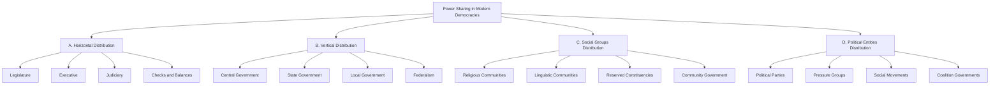
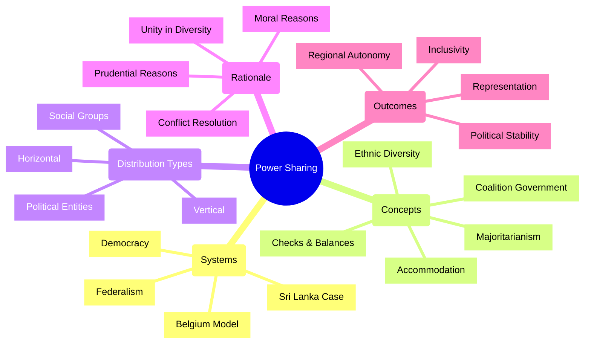

# Power Sharing: Understanding Democratic Governance - Enhanced Study Notes

## Introduction to Power Sharing

- Power sharing is a cornerstone of democratic systems, representing the distribution of authority among various entities within a state.
- It encompasses:
  - Division of power among primary organs of government (legislature, executive, judiciary)
  - Allocation of responsibilities across different governance levels (central to local)
  - Inclusion of diverse social groups (religious and linguistic communities)
  - Participation of various political actors (parties, pressure groups, movements)
- Power sharing ensures no single entity holds absolute control, fostering a balanced and inclusive political landscape.
- The essence of democracy lies in distributing power among people and their representatives rather than concentrating it among a few.
- Power sharing maintains political stability and serves as a practical approach to conflict resolution.

## Case Studies in Power Sharing

### A. Belgium: A Model of Accommodation

- **Population Composition**:
  - Dutch-speaking Flemish: 59%
  - French-speaking Walloons: 40%
  - German-speaking minority: 1%
  - Brussels: 80% French-speaking, 20% Dutch-speaking

- **Historical Context**:
  - French-speaking community historically held greater wealth and power despite being a minority nationally
  - Socio-economic disparities fueled tensions between linguistic groups during 1950s-1960s
  - Belgian leaders recognized potential conflict and chose accommodation

- **Constitutional Approach**:
  - Constitution amended four times between 1970-1993
  - Demonstrated sustained commitment to inclusive governance structure

- **Key Features of Belgian Power Sharing**:
  1. Equal representation in central government (equal Dutch and French-speaking ministers)
  2. Critical laws require majority support from each linguistic group
  3. Devolution of central powers to regional governments (Flanders and Wallonia)
  4. Special status for Brussels with equal representation
  5. Unique "community government" for cultural, educational, and language matters

- **Outcomes**:
  - Averted major civic strife between linguistic communities
  - Prevented potential division of the country
  - Brussels chosen as EU headquarters, indicating international recognition of success
  - Maintained national unity by respecting distinct community interests

### B. Sri Lanka: The Consequences of Majoritarianism

- **Population Composition**:
  - Sinhala-speaking: 74%
  - Tamil-speaking: 18% (Sri Lankan Tamils 13%, Indian Tamils 5%)
  - Religious divisions: Most Sinhala are Buddhists; most Tamils are Hindus or Muslims
  - Christians: 7% (both Tamil and Sinhala)

- **Post-Independence Developments**:
  - Rise of majoritarianism after independence in 1948
  - Sinhala leaders established dominance leveraging numerical majority
  - 1956: Act passed making Sinhala the sole official language
  - Government policies favored Sinhala applicants in university admissions and employment
  - New constitution mandated protection and fostering of Buddhism

- **Consequences for Tamil Community**:
  - Growing alienation among Sri Lankan Tamils
  - Perception that major political parties were insensitive to their language and culture
  - Feeling of discrimination in jobs, education, and political rights
  - Formation of Tamil political parties demanding language recognition and autonomy
  - Escalation to demands for independent Tamil Eelam state by 1980s

- **Outcome**:
  - Eruption of prolonged civil war (ended in 2009)
  - Thousands of lives lost
  - Families displaced as refugees
  - Severe hampering of national progress
  - Deep social scars

### C. Comparative Analysis

| Feature | Belgium | Sri Lanka |
|---------|---------|-----------|
| **Ethnic Diversity** | Dutch (Majority), French (Minority), German (Very Small Minority) | Sinhala (Majority), Tamil (Minority) |
| **Approach to Diversity** | Accommodation: Constitutional amendments to ensure equal representation and community governance | Majoritarianism: Policies favoring the Sinhala majority, disregarding the Tamil minority |
| **Power Sharing** | Yes, at central, state, and community levels | No significant power sharing with the Tamil minority |
| **Outcome** | Peaceful coexistence, avoided civil strife, Brussels as EU headquarters | Civil war, social and economic setbacks |
| **Key Lesson** | Unity achieved by respecting diverse interests and sharing power | Unity undermined by majority dominance and refusal to share power |

## Why is Power Sharing Desirable?

### A. Prudential Reasons

- **Conflict Reduction**:
  - Reduces likelihood of conflict between social groups
  - Ensures various groups have a stake in governance
  - Fosters inclusion and reduces potential grievances
  - Contributes to social harmony and peace

- **Political Stability**:
  - Prevents concentration of power that can lead to instability
  - Creates more resilient political systems
  - Protects against upheaval in socially divided societies

- **Protection Against Tyranny**:
  - Avoids tyranny of the majority
  - Provides safeguards for minority rights and interests
  - Ensures more just and equitable society

- **Better Governance**:
  - Decisions made through consultation and negotiation
  - More balanced policies reflecting diverse needs
  - More effective outcomes for the country as a whole
  - Better long-term strategy than majority imposition

### B. Moral Reasons

- Embodies the spirit of democracy
- Upholds the right of citizens to participate in governance
- Recognizes that power should be shared with those affected by its exercise
- Increases legitimacy of government through citizen participation
- Maximizes people's involvement in their own governance
- Ensures equal participation of all communities
- Accommodates diverse social, cultural, and linguistic groups
- Strengthens democratic foundations
- Fosters national integration
- Recognizes the inherent worth and dignity of all citizens

```mermaid
flowchart TD
    PS[Power Sharing]
    PS --> PR[Prudential Reasons]
    PS --> MR[Moral Reasons]
    
    PR --> CR[Conflict Reduction]
    PR --> PS1[Political Stability]
    PR --> TA[Protection Against Tyranny]
    PR --> BG[Better Governance]
    
    CR --> CRA[Ensures groups have stake in governance]
    CR --> CRB[Reduces grievances and resentment]
    
    PS1 --> PSA[Prevents concentration of power]
    PS1 --> PSB[Creates resilient political systems]
    
    TA --> TAA[Avoids tyranny of majority]
    TA --> TAB[Safeguards minority rights]
    
    BG --> BGA[Balanced policies through consultation]
    BG --> BGB[Effective outcomes for entire country]
    
    MR --> SD[Spirit of Democracy]
    MR --> CP[Citizen Participation]
    MR --> LG[Legitimate Government]
    MR --> NI[National Integration]
    
    SD --> SDA[Power should be distributed widely]
    SD --> SDB[Aligns with democratic ideals]
    
    CP --> CPA[Right to be consulted on governance]
    CP --> CPB[Voice for all citizens]
    
    LG --> LGA[Citizens have stake in the system]
    LG --> LGB[Maximizes participation]
    
    NI --> NIA[All groups feel valued]
    NI --> NIB[Accommodates diversity]

```

## Forms of Power Sharing in Modern Democracies

### A. Horizontal Distribution of Power

- Sharing power among different organs of government at the same level
- Involves legislature (makes laws), executive (implements laws), and judiciary (interprets laws)
- Also known as "separation of powers"
- Different branches exercise distinct powers while operating at the same level
- Incorporates system of checks and balances
- Each organ can scrutinize and limit actions of others
- Prevents concentration of power and potential abuse
- Example: In India, judiciary reviews laws and executive actions; executive implements legislature's laws

### B. Vertical Distribution of Power

- Involves sharing power among governments at different levels
- Commonly referred to as federalism or federal division of power
- Power divided between central government and provincial/state governments
- Allows for unified national government while accommodating regional diversities
- Constitution defines powers and responsibilities of each level
- Example: India's Union Government and State Governments
- Can extend to lower levels like municipalities and panchayats
- In true federalism, state governments enjoy autonomy in defined spheres
- Ensures governance is both comprehensive nationally and responsive locally

### C. Power Sharing Among Different Social Groups

- Power shared among religious and linguistic communities
- Critical in diverse societies for inclusive governance
- Ensures all significant social groups have voice and stake
- Prevents alienation and marginalization
- Example: Belgium's 'Community Government' for language groups
- Example: India's reserved constituencies for Scheduled Castes and Tribes
- Fosters inclusivity, social harmony, and sense of belonging

### D. Power Sharing Among Political Parties, Pressure Groups, and Movements

- Extends to interactions among various political entities
- Competition among parties prevents power concentration
- Coalition governments formed when no single party has clear majority
- Pressure groups represent specific interests (traders, farmers, workers)
- Pressure groups influence through committees, lobbying, mobilization
- Social movements raise awareness and exert pressure on government
- Ensures power isn't confined to formal government structures
- Creates dynamic interplay in broader political landscape

## Summary: The Significance of Power Sharing

- Power sharing is fundamental to democratic governance
- Essential for stability, inclusivity, and conflict prevention in diverse societies
- Case studies highlight importance of accommodation vs. dangers of majoritarianism:
  - Belgium's multi-level power sharing fostered peaceful coexistence
  - Sri Lanka's majoritarianism led to alienation and civil war
- Desirable for both prudential and moral reasons
- Manifests in various forms in modern democracies:
  - Horizontal distribution among government branches
  - Vertical distribution through federalism
  - Sharing among different social groups
  - Influence of political parties, pressure groups, and movements
- Strengthens democracy by ensuring all sections have voice and stake
- Fosters a more just and harmonious society

## Definitions of Key Terms Related to Power Sharing

**Power Sharing**: Distribution or decentralization of power among government organs and at different levels, as well as among social groups and political entities. A democratic system where power is divided among various bodies, ensuring no single organ has unlimited power.

**Ethnic**: A social division based on shared culture. People belonging to the same ethnic group believe in their common descent because of similarities of physical type or of culture or both.

**Majoritarianism**: The belief that a particular community present as the majority must be able to rule a country through its power and beliefs, ignoring the needs of the minority groups. The idea that the majority group should have the freedom to govern a nation.

**Prudential Reason**: Reasons for power sharing based on careful calculation of gains and losses, emphasizing better outcomes and reduced conflict.

**Moral Reason**: Reasons for power sharing that emphasize the act of power sharing as valuable in itself, as it aligns with the spirit of democracy and ensures people's participation.

**Horizontal Distribution of Power**: Sharing of power among different organs of government at the same level, such as the legislature, executive, and judiciary.

**Vertical Distribution of Power**: Sharing of power at different levels of government, such as central, state, and local governments. Also known as Federal Division of Power or Federalism.

**Community Government**: A type of government elected by members of a particular language-speaking group (Dutch, French, German in Belgium) that has power over cultural, educational, and language-related issues.

**Coalition Government**: A government formed by an alliance of two or more political parties, where power is shared among them.

**Checks and Balances**: A system where each organ of the government has the power to limit the power of the other organs, ensuring that no single organ can exercise unlimited power.

**Federalism**: A system of government in which power is divided between a central government and regional (state or provincial) governments.

## Picture Study Analysis

### Picture 1: Map of Belgium showing linguistic regions
- Visually represents ethnic diversity with clear demarcation of Dutch, French, and German-speaking areas
- Highlights Brussels' unique linguistic composition within the Flemish region
- **Analysis Questions**: 
  - How does geographical distribution necessitate complex power-sharing?
  - Why is Brussels a focal point in Belgium's power-sharing model?

### Picture 2: Timeline of Sri Lanka's history related to majoritarianism
- Shows progression from independence to majoritarianism policies to civil war
- **Analysis Questions**:
  - What were immediate consequences of the Sinhala Official Language Act?
  - How did denial of Tamil autonomy demands contribute to conflict escalation?
  - What does timeline suggest about long-term impact of majoritarianism?

### Picture 3: Diagram of horizontal power distribution
- Depicts separation of powers with legislature, executive, and judiciary
- Shows checks and balances through connecting arrows
- **Analysis Questions**:
  - Why is separation of powers fundamental to democracy?
  - How do checks and balances prevent power abuse?
  - Provide a real-world example of one branch checking another

### Picture 4: Diagram of vertical power distribution in India
- Shows hierarchical structure from central to state to local government
- Indicates flow of power and responsibilities
- **Analysis Questions**:
  - What are advantages of multi-tiered government?
  - How does vertical distribution cater to India's diversity?
  - What specific responsibilities might each level handle?

### Picture 5: Photograph of leaders from different political parties
- Shows political leaders in discussion, representing coalition governance
- **Analysis Questions**:
  - When are coalition governments typically formed?
  - What are benefits and challenges of multi-party power sharing?
  - How do coalitions reflect principles of democratic inclusivity?

## Keywords and Important Terms

